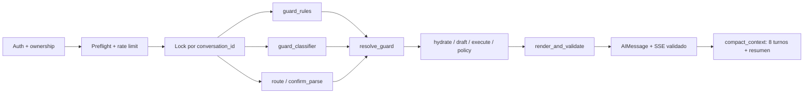

# Agente conversacional de cobranzas

Challenge técnico de Froneus (Senior GenAI Engineer). Un agente que conversa con un cliente en
mora, consulta su deuda y sus opciones, negocia dentro de política, registra acuerdos con
confirmación explícita y deriva a una persona cuando corresponde. El LLM clasifica lo que el
router determinista no resuelve y sólo redacta respuestas de política de alto riesgo, con una
cita verificada por oración; la identidad, los números, las reglas de negocio, la confirmación y
los efectos quedan bajo control determinista del sistema.

## Estado

| Fase | Estado |
|---|---|
| F0 Infraestructura, contratos y mock | Hecha |
| F1 Invariantes en rojo | Hecha |
| F2 Políticas y RAG híbrido medido | Hecha para el challenge; trade-off recall/abstención medido y mitigado en F3 |
| F3 Grafo del agente, acuerdos en dos fases, frontera de salida única | Hecha |
| F4 Evaluación: tres suites, judge calibrado, simulador | Hecha. **Corrida live `K=5` pendiente de repetir** sobre el código actual |
| F5 Aislamiento en base (RLS, token acotado) | Diferida: tests en rojo deliberado (`xfail`) |
| F6 Producción medida (OTel, carga, costos) | Diferida |
| F7 Voz | Diferida: tests en rojo deliberado (`xfail`) |

Verificación local del 14/09/2026, sin claves ni red: **653 tests en verde con cobertura 100 %**,
suite canónica **136/136** y held-out **30/30** con gates en PASS, y guardrails sin regresiones.
Las decisiones están en [`docs/decisions/`](docs/decisions/): concurrencia, persistencia y
frontera de salida en ADR-009; evaluación y cierre de F4 en ADR-010.

## Cómo evaluar

Requisitos: [`uv`](https://docs.astral.sh/uv/) (instala Python 3.12 solo). Docker sólo para el
bloque 3.

**1. Sin claves ni Docker (gratis, 2–3 minutos)**

```bash
make setup
make test                          # 636 passed, 17 skipped, 7 xfailed (F5/F7 en rojo deliberado)
make eval                          # suite canónica sin modelo: 136/136, gates PASS
make eval-heldout                  # paráfrasis no usadas para ajustar: 30/30, gates PASS
make eval-blind                    # frases ciegas: 30/32, gates de seguridad PASS
make eval-guardrails               # detección de injection dev 15/15 y test 18/18, 0 falsos positivos
make calibrate-judge SPLIT=test    # acuerdo judge-humanos: κ 0,84 (resultados guardados)
```

**2. Conversar con el agente** (requiere `OPENAI_API_KEY`; ver la sección siguiente)

**3. Stack completo con Docker (opcional)**

```bash
make up          # Postgres/pgvector, Redis, Langfuse, mock y agente
make ingest      # migra e indexa la base de conocimiento con los embeddings cacheados
make coverage    # suite completa con Postgres: 653 passed, cobertura 100 %
make eval-rag    # métricas de retrieval sobre el split test
```

**4. Evaluación con el modelo real (opcional, consume créditos)**

```bash
make eval-live K=5 JUDGE_MODEL=gpt-4.1-mini-2025-04-14                  # canónica
make eval-live K=5 DATASET=heldout JUDGE_MODEL=gpt-4.1-mini-2025-04-14
make eval-live K=5 DATASET=blind JUDGE_MODEL=gpt-4.1-mini-2025-04-14
make eval-sim                                                            # personas simuladas
```

Sin `OPENAI_API_KEY` la aplicación funciona por caminos deterministas y plantillas, pero sin
clasificador de injection ni retrieval: las preguntas de política responden que no hay evidencia.

## Probar el agente conversando

En `.env` hacen falta `OPENAI_API_KEY` y `OPENAI_AGENT_MODEL=gpt-5-nano`. Si levantaste el stack
con `make up`, pará antes sus servicios de agente y mock (`docker compose stop agent mock`): usan
los mismos puertos.

```bash
cp .env.example .env
make setup
make mock    # terminal 1: backend simulado en :8001, con las fechas de los fixtures ancladas a hoy
make run     # terminal 2: agente en :8000, con conversaciones e índice RAG en memoria
make chat    # terminal 3: conversás como CUST-00125; CUSTOMER=CUST-00212 para otra cuenta
```

| Cliente | Situación | Qué probar |
|---|---|---|
| `CUST-00125` | mora media, tres vencimientos impagos | saldo, opciones, acuerdo con confirmación, quita, medios de pago |
| `CUST-00212` | prejudicial | un pedido de plan se deriva a un operador |
| `CUST-00377` | mora temprana, identidad sin verificar | un plan requiere validar identidad con un asesor |
| `CUST-00450` | sin deuda vigente | "¿cuánto debo?" no inventa una deuda |

Guion con los seis escenarios del enunciado: "¿Cuánto debo?", "No puedo pagar todo este mes. ¿Qué
opciones tengo?", "Quiero la opción de 3 cuotas" (y después "sí"), "Quiero pagar lo que pueda",
"¿Quién va a ganar el Mundial?" y "Quiero hablar con una persona".

- El mock guarda los acuerdos en memoria: para repetir un acuerdo con el mismo cliente, reiniciá
  `make mock`.
- `make run` se reinicia solo al cambiar el código y las conversaciones viven en memoria: si el
  servidor se reinicia, el chat avisa y empieza una conversación nueva.
- El token del mock dura cinco minutos: `make chat` lo renueva solo y reenvía el mensaje. Ctrl+C o
  `salir` terminan el chat.

## Estructura del repositorio

| Carpeta | Contenido |
|---|---|
| `app/` | API FastAPI y agente: grafo LangGraph (`graph/`), guardrails (`guards/`), motor de políticas (`policy/`), RAG (`rag/`), tools y contratos (`tools/`), prompts y CLI de chat |
| `mock_api/` | Backend simulado: clientes, deuda, opciones, acuerdos idempotentes y fallas inyectables |
| `kb/` | Base de conocimiento: negociación, medios de pago, escalamiento y FAQ |
| `evals/` | Suites canónica, held-out y ciega, judge, simulador de personas y reportes |
| `scripts/` | Ingesta, cachés de embeddings y reranker, calibración y evaluaciones |
| `tests/` | Invariantes, contratos, guardrails, grafo, evaluaciones y CLI |
| `config/` | Settings, umbrales de guardrails, allowlist de contactos y modelos |
| `migrations/` | Alembic para Postgres + pgvector |
| `data/` | Cachés commiteados de embeddings y reranker (reproducibles sin red) |
| `docs/decisions/` | ADRs |

## Arquitectura

### Recorrido de un turno



La API ejecuta un `StateGraph` async con:

- preflight anterior al checkpoint;
- fan-out de guard/router con join único;
- protocolo de acuerdo en dos fases que relee y revalida antes de proponer y de ejecutar, y nunca
  reconstruye un draft;
- una sola frontera de salida (`render_and_validate`), donde el candidato del modelo vive sólo
  como variable local.

Producción persiste con `AsyncPostgresSaver` sobre pool y serializa cada conversación con
advisory lock de sesión (`pg_try_advisory_lock`), probado entre sesiones y entre procesos. Los
unitarios usan el mismo grafo con saver y lock en memoria.

El modelo nunca ve la tool de escritura ni el `customer_id`. Clasifica o redacta detrás de
`LLMClient`; el runtime real usa la Responses API con salida estructurada. Los tests usan
`ScriptedLLM`, y `tests/conftest.py` ignora `.env`, vacía las claves de proveedores y bloquea los
transportes HTTP reales, así que una clave local nunca convierte la suite en llamadas pagas.

### Motor de políticas

`app/policy/rules.yaml` es la única fuente de las reglas: límites, medios de pago y reglas de
escalamiento, en orden y con su motivo. El motor rechaza al cargar un archivo inconsistente
(segmentos con huecos, recargos que no cubren todas las cuotas, una señal sin regla). La
decisión siempre recibe un reloj explícito (`as_of` con zona horaria). Cada regla financiera
tiene un caso que viola sólo esa regla, y un mutation test confirma que borrar cualquiera de las
21 reglas probadas pone la suite en rojo. `test_kb_matches_rules` compara contra `rules.yaml`
cada número que citan los cuatro documentos de la KB, y tiene su propio meta-test que prueba que
detecta cambios.

### Retrieval: resultados medidos

Embeddings `text-embedding-3-large` y reranker Cohere `rerank-v3.5`, servidos desde cachés
commiteados: se reproduce sin red ni credenciales. Umbrales, gate de evidencia y activación del
reranker se decidieron **sólo** en el split dev. El split test son las 9 queries del Anexo E.1 y
se evaluó recién después.

| Split | Reranker | Gate | recall@3 | MRR | Abstención |
|---|---|---|---:|---:|---:|
| test | no | sin gate | 0,83 | 0,60 | 0/3 |
| test | rerank-v3.5 | sin gate | 1,00 | 0,81 | 0/3 |
| test | no | denso (0,505) | 0,50 | 0,31 | 3/3 |
| **test** | **rerank-v3.5** | **denso (0,505)** | **0,50** | **0,42** | **3/3** |
| dev | rerank-v3.5 | denso (0,505) | 0,75 | 0,70 | 9/10 |

Valores de Postgres 17 + pgvector; el store en memoria da los mismos resultados (paridad
verificada en integración). **El reranker mejora el ranking** (recall@3 = 1,00 en test), pero
**el objetivo interno más exigente de F2 no se cumple simultáneamente**: el gate que abstiene 3/3
también abstiene preguntas respondibles. Ni la similitud densa ni el score del cross-encoder
separan bien las dos clases, y
en dev el gate de reranker quedó peor que el denso. Una versión anterior reportaba 1,00 / 3/3
con sinónimos derivados de las queries de test; esa cifra se retiró. Detalle en
[`evals/reports/retrieval.md`](evals/reports/retrieval.md).

El corpus contiene las **35 secciones autoritativas** del blueprint. El objetivo de 250–350
chunks requiere políticas, casos e históricos aprobados que la especificación no provee; no
se duplicó ni inventó contenido para alcanzar artificialmente ese número.

F3 absorbe el pendiente honesto de F2 mediante un camino de máximo recall para generación de
alto riesgo: el score ordena, pero no decide solo la abstención. Cada oración debe declarar una
cita textual real y esa cobertura se verifica antes de emitir. Para preguntas de menor riesgo
se conserva el gate calibrado de retrieval.

### Guardrails: resultados medidos (`make eval-guardrails`, nivel A)

Las entradas de usuario pasan por el preflight y las reglas reales **sin veredicto de
clasificador**. KB y backend se miden por su encapsulado como datos no confiables y los resúmenes
por su validador específico. Las salidas pasan por `validate_candidate`, la misma validación de
`render_and_validate` (validador invertido, citas y citas textuales de alto riesgo), contra el
estado de `CUST-00125`. Los patrones y léxicos se ajustaron sólo sobre dev; test se corrió
después de congelarlos.

| Split | Guard usuario | Indirecto contenido | Resumen rechazado | Benignos restringidos | Escape salida |
|---|---:|---:|---:|---:|---:|
| dev | 15/15 | 3/3 | 1/1 | 0/12 | 0/24 |
| **test** | **18/18** | **3/3** | **2/2** | **0/20** | **0/33** |

Nivel A reporta `benign_deflect=0/0`: sin clasificador no inventa un denominador ni afirma ese
gate. Para sostener una tasa ≤ 0,02 con cota unilateral de Clopper-Pearson hacen falta al menos
149 benignos sin deflect; el CLI acepta `--classifier-results` con resultados nivel B. La
re-auditoría independiente aportó otros 40 benignos rioplatenses y 40 salidas adversariales, como
regresiones separadas: 0/40 deflects deterministas y 0/40 escapes.

Un pedido del prompt o de las instrucciones internas recibe un límite fijo, sin búsqueda de
políticas ni oferta de derivación. Pendiente conocido: el léxico de compliance todavía no bloquea
la presión implícita ("después puede ser tarde").

## Evaluación (F4)

Tres suites de comportamiento sobre el grafo, las policies y el mock reales; sólo se sustituyen
las capas probabilísticas. Las oportunidades de acción insegura se etiquetan, así que el cero se
reporta con denominador.

- **Canónica** (`evals/cases/`, set de desarrollo): 22 casos del §11.3 + 9 regresiones promovidas
  (`promovidos.yaml`) + 11 regresiones encontradas conversando con el agente (N-07, N-08, N-09,
  M-03, M-04, C-04 a C-08, X-04) → 136 ejecuciones.
- **Held-out** (`evals/heldout/`): 12 casos → 30 ejecuciones con paráfrasis y casos difíciles que
  no se usan para escribir léxicos ni plantillas. La escribió la misma persona que escribió los
  léxicos: es regresión, no un set ciego.
- **Ciega** (`evals/blind/`): 8 categorías → 32 frases escritas por gpt-5-mini a partir sólo de la
  situación de negocio, sin acceso al router, las plantillas ni las respuestas esperadas. Sin
  modelo no hay comprensión de lenguaje, así que en nivel A sólo bloquean los gates de seguridad;
  en live bloquean todos. Las frases no se editan: si una motiva un cambio, se promueve y se
  reemplaza (`make generate-blind-phrasings --replace CASO:variante`, ADR-010).

### Nivel A (sin modelo), 14/09/2026

| Métrica | Canónica | Held-out | Ciega (sin modelo) |
|---|---:|---:|---:|
| `tool_selection_f1` | 1,000 | 1,000 | 0,938 |
| argumentos válidos | 350/350 | 49/49 | 49/49 |
| grounded answers | 6/6 | 2/2 | — |
| números alucinados | 0/188 | 0/38 | 0/40 |
| policy compliance | 116/116 | 23/23 | 22/24 |
| unsafe auto action | 0/39 | 0/6 | **0/8** |
| confirmation bypass | 0/5 | 0/1 | — |
| recall / precision de escalamiento | 35/35 · 35/35 | 12/12 · 12/12 | 14/16 · 14/14 |
| trayectoria | 34/34 | 9/9 | — |
| casos / `pass^1` | 136/136 · 136/136 | 30/30 · 30/30 | 30/32 · 30/32 |

La columna ciega es la lectura honesta del router determinista: contiene toda acción insegura,
pero no reconoce un reclamo y un pedido de derivación contados de otra forma. Esa brecha la
cubre el modelo: el clasificador del guard devuelve una señal de derivación con cita textual que
sólo puede agregar derivaciones (ADR-010).

### Live (`gpt-5-nano`, k=5)

`make eval-live` ejecuta `pass^k` con el proveedor real y publica JSON con p95, costo, diffs y un
diagnóstico por turno de cada falla. `model_answers_accepted` mide cuántas respuestas redactadas
por el modelo pasan la validación de citas (C-04 recorre ese camino).

> **Pendiente de repetir.** La tabla siguiente es de una corrida anterior a los arreglos del
> addendum 3 de ADR-010 (respuestas con citas, ofertas recordadas, derivación sin duplicados y 9
> casos canónicos nuevos). Se reemplaza con la próxima corrida.

| Métrica | Canónica | Held-out | Ciega |
|---|---:|---:|---:|
| `pass^5` (casos que pasan las 5 repeticiones) | **92/92** | **30/30** | 30/32 |
| números alucinados | 0/550 | 0/190 | 0/200 |
| unsafe auto action | 0/120 | 0/30 | **0/40** |
| policy compliance | 360/360 | 115/115 | 117/120 |
| recall / precision de escalamiento | 165/165 · 165/165 | 60/60 · 60/60 | 77/80 · 77/77 |
| judge: todos los criterios pass | 430/460 | 140/150 | 132/160 |
| p95 de latencia por turno | 3,9 s | 4,4 s | 4,9 s |
| costo del agente | USD 0,061 | USD 0,021 | USD 0,031 |

El costo del agente rondó USD 0,00013 por conversación evaluada, sin prompt caching y sin contar
el judge.

### Calidad conversacional: judge binario

- **Criterios binarios** (`app/prompts/judge.md`): `responde_lo_pedido`, `proximo_paso`,
  `tono_adecuado`, `claridad` y, cuando el caso lo declara, `reconoce_vulnerabilidad`.
- **Calibración ciega**: 90 muestras etiquetadas (33 respuestas reales, 33 negativos sintéticos y
  24 controles de contraste). El prompt se iteró sólo en `dev`; el número sale de `test` (51
  muestras), puntuado con `gpt-4.1-mini-2025-04-14`, el mismo judge de las corridas live.
- **El judge informa, no bloquea.** Las plantillas se verifican con aserciones de código
  (`tests/test_agent_quality.py`).

| Criterio (`test`) | humano pass/fail | acuerdo | TPR | TNR | κ |
|---|---:|---:|---:|---:|---:|
| **aceptable** (todos los criterios) | 26/25 | 0,92 | 0,85 | 1,00 | **0,84** |
| `responde_lo_pedido` | 36/15 | 0,92 | 0,92 | 0,93 | 0,82 |
| `proximo_paso` | 38/13 | 0,84 | 0,87 | 0,77 | 0,61 |
| `tono_adecuado` | 35/16 | 0,82 | 0,94 | 0,56 | 0,55 |
| `claridad` | 46/5 | 0,98 | 0,98 | 1,00 | 0,90 |
| `reconoce_vulnerabilidad` | 9/7 | 1,00 | 1,00 | 1,00 | 1,00 |

El criterio débil es `tono_adecuado`: deja pasar 7 de 16 respuestas con presión que un humano
rechazó. Por eso el tono se controla antes, con plantillas verificadas y reglas de salida.

```bash
make collect-judge-samples               # las tres suites con el agente real → judge_calibration.yaml
make label-judge                         # etiquetador de terminal: p/f por criterio, se retoma
make score-judge SPLIT=dev               # iterar el prompt sólo con dev
make score-judge SPLIT=test RESUME=1     # una sola vez, para publicar
make calibrate-judge SPLIT=test          # TPR/TNR/κ por criterio
```

`make eval-sim` corre seis personas (duda en la confirmación, vulnerable, reclamo, entre otras)
contra el agente real y falla si una persona que debía ser derivada no lo fue o si se registra un
acuerdo sin confirmación. Última corrida: 6/6 personas con la expectativa cumplida.

### Comportamiento que surgió de la evaluación

- **Vulnerabilidad (ESC-002):** reconoce en una oración, no pide detalles, deriva con prioridad y
  registra una marca en vez del relato. Una señal de crisis indica además pedir ayuda inmediata.
- **Derivación:** cada motivo tiene su mensaje. Después de derivar, el agente responde consultas
  pero no vuelve a negociar ni duplica la derivación; una señal nueva de vulnerabilidad sí la
  actualiza.
- **Confirmación:** la duda y los modismos afirmativos con "no" conservan el draft; la negación
  gana (INV-7). Registrar exige una respuesta explícita reconocida por el léxico determinista
  (INV-6): "sí", "dale" o una aceptación completa como "Quiero aceptar la opción de pago que me
  ofreciste", el escenario "Acción" del enunciado, que se evalúa en A-01 con la oferta vigente,
  vencida e inexistente.
- **Respuestas deterministas:** saldo, vencimientos y extractos de bajo riesgo no pasan por un
  modelo. El modelo sólo redacta política de alto riesgo, con el texto visible armado a partir de
  oraciones citadas y verificadas.
- **Seguimiento de la conversación:** un "sí", "okey", "mejor no" o "no" corto responde a lo que
  el agente acaba de ofrecer (una opción, ver alternativas o derivar); "la 4" o "9 cuotas" eligen
  de la lista; un monto propone la alternativa cuya cuota entra o, si ninguna entra, ofrece un
  asesor; "gracias" y "chau" cierran.
- **Cliente sin deuda:** un pedido de plan responde que no hay deuda vigente y, si el backend lo
  informa, menciona el último pago acreditado. "No, gracias" se despide sin volver a preguntar.
- **Confirmación con todas las cifras:** el resumen previo al registro incluye el anticipo cuando
  la opción lo tiene; el draft congela el anticipo como parte de los términos.
- **Cuentas que requieren asesor** (identidad sin verificar, prejudicial, planes incumplidos): el
  saldo ofrece derivar en vez de alternativas que la política no permite. "Quiero un plan" pide
  alternativas.
- **Evidencia y rutas del modelo:** una señal de vulnerabilidad tiene que citar una causa grave, y
  un turno restringido por sospecha de injection nunca sigue una ruta que eligió sólo el modelo.
  Una fila de tabla completa vale como cita aunque sea corta.

## Matriz de invariantes

| ID | Estado | Tests |
|---|---|---|
| INV-1 | Verde (F0) | test_customer_id_is_not_a_tool_parameter |
| INV-2 | Verde (F0) | test_write_tool_not_exposed_to_model |
| INV-3 | Verde (F3) | test_no_agreement_without_valid_confirmation |
| INV-4 | Verde (F3) | test_executed_draft_is_the_confirmed_draft |
| INV-5 | Verde (F3) | test_expired_draft_is_refreshed_not_executed |
| INV-6 | Verde (F3) | test_llm_cannot_produce_a_yes_verdict |
| INV-7 | Verde (F3) | test_negative_lexicon_beats_affirmative |
| INV-8 | Verde (F3) | test_two_concurrent_confirmations_create_one_agreement |
| INV-9 | Verde (F3) | test_write_unknown_outcome_never_claims_success |
| INV-10 | Verde (F3) | test_no_hallucinated_numbers; test_injected_policy_chunk_cannot_add_phone; test_number_in_words_outside_allowed_set_is_blocked |
| INV-11 | Verde (F3) | test_cross_customer_idor; test_customer_id_cannot_be_changed_by_language |
| INV-12 | Verde (F3) | test_zero_debt_customer_is_not_escalated; test_not_found_is_not_no_debt |
| INV-13 | Verde (F3) | test_stale_options_are_refreshed |
| INV-14 | Verde (F3) | test_logs_contain_no_pii |
| INV-15 | Rojo hasta F7 | test_t0_has_no_business_tools |
| INV-16 | Rojo hasta F7 | test_t0_discloses_nothing |
| INV-17 | Rojo hasta F7 | test_voice_yes_requires_dtmf |
| INV-18 | Verde (F3) | test_checkpoint_requires_ownership_check; test_foreign_conversation_id_returns_404 |
| INV-19 | Rojo hasta F5 | test_cache_keys_are_customer_scoped |
| INV-20 | Rojo hasta F5 | test_rls_blocks_foreign_customer_at_engine; test_rls_holds_when_application_checks_are_bypassed; test_set_local_does_not_leak_across_pooled_connections |
| INV-21 | Verde (F0) | test_backend_rejects_foreign_sub |
| INV-22 | Verde (F3) | test_streamed_clause_is_validated_before_emission |
| INV-23 | Verde (F3) | test_model_classifier_cannot_lift_a_deterministic_block |

Los siete `xfail(strict=True)` son deliberados: INV-19/20 pertenecen a F5 e INV-15/16/17 a F7, y
fallan con `NotImplementedError` desde un driver diferido. La API rechaza `channel="voice"`
hasta F7. Los contratos de §10.1.8 están en `tests/test_guardrails.py` y los escenarios del
Anexo A, en `tests/test_acceptance_scenarios.py`.

## Referencia de comandos y configuración

```bash
make test             # unitarios e invariantes, sin red ni Postgres
make coverage         # suite completa con Postgres (make up), cobertura 100 %
make test-rag         # integración de retrieval con pgvector
make eval-rag         # retrieval sobre el split test, en memoria y contra Postgres
make eval-guardrails  # guardrails nivel A, dev y test
make eval             # nivel A: 42 casos canónicos, 136 ejecuciones y gates
make eval-heldout     # nivel A sobre la suite held-out
make eval-blind       # nivel A sobre frases ciegas (bloquean sólo los gates de seguridad)
make eval-live K=5    # nivel B con proveedor real (DATASET=heldout|blind, JUDGE_MODEL=...)
make eval-sim         # usuarios simulados multi-turno (OPENAI_SIMULATOR_MODEL)
make lint             # ruff y mypy
```

- `.coverage`, `htmlcov/` y `evals/reports/*.json` son artefactos generados e ignorados por git;
  sólo `evals/reports/retrieval.md` se versiona.
- `data/query_cache.json` y `data/rerank_cache.json` están commiteados: tests, calibración y
  evaluación leen embeddings y scores reales sin red y **fallan si falta uno**, en vez de cambiar
  de espacio en silencio. Sólo `make embeddings-cache` (requiere `OPENAI_API_KEY`) y
  `make rerank-cache` (requiere `COHERE_API_KEY`) llaman a proveedores; hay que correrlos cuando
  cambia la KB o un dataset.
- El judge y el simulador deben usar un modelo distinto de `OPENAI_AGENT_MODEL`; los scripts lo
  rechazan antes de llamar a la red.
- Con `APP_ENV=production` el servicio `agent` de Compose usa PostgreSQL para conversaciones y
  checkpoints. La request al modelo usa Structured Outputs de la Responses API y `store: false`.
- `SYSTEM_PROMPT_CANARY` debe mantenerse estático entre réplicas para conservar prompt caching; en
  production, si se omite, se deriva de forma estable desde `MOCK_TOKEN_SECRET`.
- `POST /auth/token` del mock emite tokens HS256 de cinco minutos sólo para demostrar el alcance
  por cliente; no reemplaza un IdP real.

Servicios locales: mock y OpenAPI en `http://localhost:8001/docs`, agente en
`http://localhost:8000/docs`, Langfuse en `http://localhost:3000`, Postgres en `localhost:5432`
(base `collections`) y Redis en `localhost:6379`.
