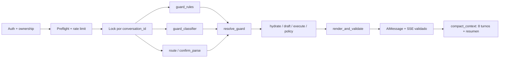
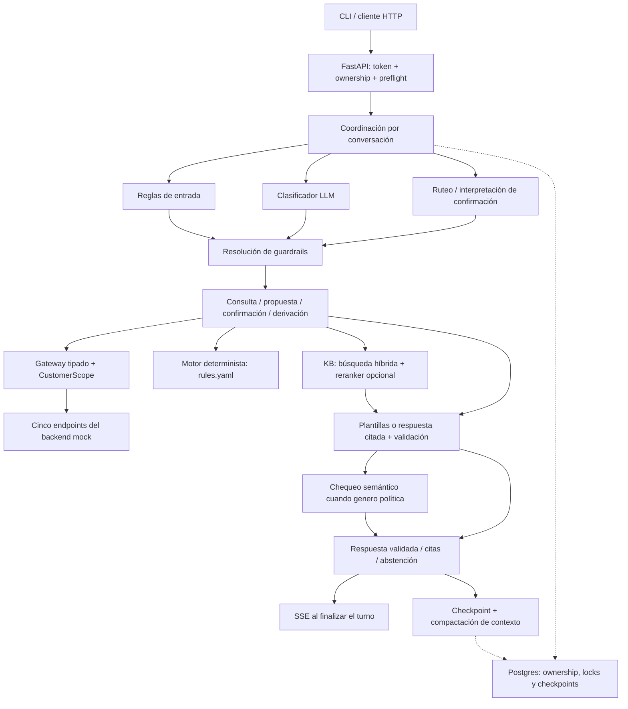

# Agente conversacional de cobranzas

Challenge técnico de Froneus (Senior GenAI Engineer). Un agente que conversa con un cliente en
mora, consulta su deuda y sus opciones, negocia dentro de política, registra acuerdos con
confirmación explícita y deriva a una persona cuando corresponde. El LLM clasifica lo que el
router determinista no resuelve y responde preguntas de política con citas verificadas por código
y un chequeo semántico; la identidad, los números, las reglas de negocio, la confirmación y los
efectos quedan bajo control determinista del sistema.

## Estado

| Fase | Estado |
|---|---|
| F0 Infraestructura, contratos y mock | Hecha |
| F1 Invariantes en rojo | Hecha |
| F2 Políticas y RAG híbrido medido | Hecha para el challenge; trade-off recall/abstención medido y mitigado en F3 |
| F3 Grafo del agente, acuerdos en dos fases, frontera de salida única | Hecha |
| F4 Evaluación: suites, judge calibrado, simulador, `pass^5` | Implementada y medida. Gates de seguridad en PASS; `pass^5` 140/144, 28/30 y 31/32. Quedan en rojo dos gates por sobre-abstención en política (ver [Live](#live-gpt-5-nano-k5-2026-09-15)) |
| F5 Aislamiento en base (RLS, token acotado) | Diferida: tests en rojo deliberado (`xfail`) |
| F6 Producción medida (OTel, carga, costos) | Diferida |
| F7 Voz | Diferida: tests en rojo deliberado (`xfail`) |

Verificación del 15/09/2026:
- **Tests:** 783 pasan con Postgres y cobertura 100 % (765 sin Postgres).
- **Nivel A:** canónica 144/144, held-out 30/30 y ciega 30/32, con gates en PASS.
- **Guardrails:** gates de merge en PASS.
- **Live `K=5`:** los números están en la sección de evaluación.

Las decisiones están en [`docs/decisions/`](docs/decisions/):
- ADR-009: concurrencia, persistencia y frontera de salida;
- ADR-010: judge y suites de F4;
- ADR-011: respuestas de política, métricas que pueden fallar y desviaciones medidas de la
  especificación.

## Cómo evaluar

Requisitos: [`uv`](https://docs.astral.sh/uv/) (instala Python 3.12 solo). Docker sólo para el
bloque 3.

**1. Sin claves ni Docker (gratis, 2–3 minutos)**

```bash
make setup
make test                          # 765 passed, 18 skipped, 7 xfailed (F5/F7 en rojo deliberado)
make eval                          # suite canónica sin modelo: 144/144, gates PASS
make eval-heldout                  # paráfrasis no usadas para ajustar: 30/30, gates PASS
make eval-blind                    # frases ciegas: 30/32, gates de seguridad PASS
make eval-guardrails               # dev 15/15 y test 18/18, 0 escapes; falla si un gate cae
make calibrate-judge SPLIT=test    # acuerdo judge-humanos: κ 0,84 (resultados guardados)
```

**2. Conversar con el agente** (requiere `OPENAI_API_KEY`; ver la sección siguiente)

**3. Stack completo con Docker (opcional)**

```bash
make up          # Postgres/pgvector, Redis, Langfuse, mock y agente
make ingest      # migra e indexa la base de conocimiento con los embeddings cacheados
make coverage    # suite completa con Postgres: 783 passed, cobertura 100 %
make eval-rag    # métricas de retrieval sobre el split test
```

**4. Evaluación con el modelo real (opcional, consume créditos)**

```bash
make eval-live K=5 JUDGE_MODEL=gpt-4.1-mini-2025-04-14                  # canónica
make eval-live K=5 DATASET=heldout JUDGE_MODEL=gpt-4.1-mini-2025-04-14
make eval-live K=5 DATASET=blind JUDGE_MODEL=gpt-4.1-mini-2025-04-14
make eval-sim                                                            # personas simuladas
make eval-policy LIVE=1 DATASET=evals/policy_blind.yaml                  # preguntas de política ciegas
```

Sin `OPENAI_API_KEY` la aplicación funciona por caminos deterministas y plantillas, pero sin
clasificador de injection ni retrieval: las preguntas de política responden que no hay evidencia.

## Probar el agente conversando

En `.env` hacen falta `OPENAI_API_KEY` y `OPENAI_AGENT_MODEL=gpt-5-nano`. Si levantaste el stack
con `make up`, pará antes sus servicios de agente y mock (`docker compose stop agent mock`): usan
los mismos puertos.

```bash
cp .env.example .env
make setup
make mock    # terminal 1: backend simulado en :8001, con las fechas de los fixtures ancladas a hoy
make run     # terminal 2: agente en :8000, con conversaciones e índice RAG en memoria
make chat    # terminal 3: conversás como CUST-00125; CUSTOMER=CUST-00212 para otra cuenta
```

| Cliente | Situación | Qué probar |
|---|---|---|
| `CUST-00125` | mora media, tres vencimientos impagos | saldo, opciones, acuerdo con confirmación, quita, medios de pago |
| `CUST-00212` | prejudicial | un pedido de plan se deriva a un operador |
| `CUST-00377` | mora temprana, identidad sin verificar | un plan requiere validar identidad con un asesor |
| `CUST-00450` | sin deuda vigente | "¿cuánto debo?" no inventa una deuda |

Guion con los seis escenarios del enunciado: "¿Cuánto debo?", "No puedo pagar todo este mes. ¿Qué
opciones tengo?", "Quiero la opción de 3 cuotas" (y después "sí"), "Quiero pagar lo que pueda",
"¿Quién va a ganar el Mundial?" y "Quiero hablar con una persona".

- El mock guarda los acuerdos en memoria: para repetir un acuerdo con el mismo cliente, reiniciá
  `make mock`.
- `make run` se reinicia solo al cambiar el código y las conversaciones viven en memoria: si el
  servidor se reinicia, el chat avisa y empieza una conversación nueva.
- El token del mock dura cinco minutos: `make chat` lo renueva solo y reenvía el mensaje. Ctrl+C o
  `salir` terminan el chat.
- `.claude/launch.json` levanta el mock en `:8101` y el agente en `:8100`, para probar sin tocar
  los contenedores: `uv run python -m app.cli --base-url http://localhost:8100 --mock-url
  http://localhost:8101`.

## Estructura del repositorio

| Carpeta | Contenido |
|---|---|
| `app/` | API FastAPI y agente: grafo LangGraph (`graph/`), guardrails (`guards/`), motor de políticas (`policy/`), RAG y chequeo de respuestas (`rag/`), tools y contratos (`tools/`), prompts y CLI de chat |
| `mock_api/` | Backend simulado: clientes, deuda, opciones, acuerdos idempotentes y fallas inyectables |
| `kb/` | Base de conocimiento: negociación, medios de pago, escalamiento y FAQ |
| `evals/` | Suites canónica, held-out y ciega, sets de política (regresión y ciego), judge, simulador, baselines y reportes |
| `scripts/` | Ingesta, cachés de embeddings y reranker, calibración, evaluaciones y generadores de frases ciegas |
| `tests/` | Invariantes, contratos, guardrails, grafo, evaluaciones y CLI |
| `config/` | Settings, umbrales de guardrails, allowlist de contactos y modelos |
| `migrations/` | Alembic para Postgres + pgvector |
| `data/` | Cachés commiteados de embeddings y reranker (reproducibles sin red) |
| `docs/decisions/` | ADRs |

## Arquitectura

### Recorrido de un turno



La API ejecuta un `StateGraph` async con:

- preflight anterior al checkpoint;
- fan-out de guard/router con join único;
- protocolo de acuerdo en dos fases que relee y revalida antes de proponer y de ejecutar, y nunca
  reconstruye un draft;
- una sola frontera de salida (`render_and_validate`), donde el candidato del modelo vive sólo
  como variable local.

Producción persiste con `AsyncPostgresSaver` sobre pool y serializa cada conversación con
advisory lock de sesión (`pg_try_advisory_lock`), probado entre sesiones y entre procesos. Los
unitarios usan el mismo grafo con saver y lock en memoria.

El modelo nunca ve la tool de escritura ni el `customer_id`. Clasifica o redacta detrás de
`LLMClient`; el runtime real usa la Responses API con salida estructurada. Los tests usan
`ScriptedLLM`, y `tests/conftest.py` ignora `.env`, vacía las claves de proveedores y bloquea los
transportes HTTP reales, así que una clave local nunca convierte la suite en llamadas pagas.

Cada turno tiene un presupuesto de **4 llamadas al modelo** (clasificador, respuesta, una
regeneración o el router, chequeo). Agotarlo antes de responder es un corte de seguridad que deriva
con `loop_sin_avance`. §8.3.1 fija 3; con 3, 4 de 10 respuestas de política se quedaban sin su
chequeo (ADR-011).

### Respuestas de política

1. **Retrieval acotado.** El retrieval híbrido entrega 10 secciones candidatas, con reranker
   cuando hay clave de Cohere.
2. **Una llamada responde o declina.** Cada oración lleva una cita textual. Lo que la consulta
   pide y el material no responde va en `unresolved_aspects`, y eso es una abstención. El modelo
   lee el título de cada sección y el último mensaje del asistente.
3. **El código verifica.** Cada cita tiene que ser literal en su sección y cada oración tiene que
   estar cubierta; cifras, contactos, compliance y canario pasan por el validador de salida.
4. **Un chequeo semántico revisa toda respuesta del modelo**, también las copias literales: una
   oración literal de la sección equivocada no contesta.
   - Si el chequeo la respalda, se muestra.
   - Si rechaza un claim, el cliente lee las citas completas.
   - Si no contesta la pregunta, se abstiene.
   - Si no hay presupuesto para el chequeo, en alto riesgo se abstiene y en bajo riesgo se muestran
     las citas.
5. **La abstención se gradúa por riesgo (§7.4).** En alto riesgo deriva; en bajo riesgo ofrece un
   asesor.

Sin modelo (modo local y nivel A) responde el extracto del gate calibrado de F2. En producción, y en
las evaluaciones con modelo, no hay extracto sin verificar.

### Motor de políticas

`app/policy/rules.yaml` es la única fuente de las reglas: límites, medios de pago y reglas de
escalamiento, en orden y con su motivo. El motor rechaza al cargar un archivo inconsistente
(segmentos con huecos, recargos que no cubren todas las cuotas, una señal sin regla). La
decisión siempre recibe un reloj explícito (`as_of` con zona horaria). Cada regla financiera
tiene un caso que viola sólo esa regla, y un mutation test confirma que borrar cualquiera de las
21 reglas probadas pone la suite en rojo. `test_kb_matches_rules` compara contra `rules.yaml`
cada número que citan los cuatro documentos de la KB, y tiene su propio meta-test que prueba que
detecta cambios.

### Retrieval: resultados medidos

Embeddings `text-embedding-3-large` y reranker Cohere `rerank-v3.5`, servidos desde cachés
commiteados: se reproduce sin red ni credenciales. Umbrales, gate de evidencia y activación del
reranker se decidieron **sólo** en el split dev. El split test son las 9 queries del Anexo E.1 y
se evaluó recién después.

| Split | Reranker | Gate | recall@3 | MRR | Abstención |
|---|---|---|---:|---:|---:|
| test | no | sin gate | 0,83 | 0,60 | 0/3 |
| test | rerank-v3.5 | sin gate | 1,00 | 0,81 | 0/3 |
| test | no | denso (0,505) | 0,50 | 0,31 | 3/3 |
| **test** | **rerank-v3.5** | **denso (0,505)** | **0,50** | **0,42** | **3/3** |
| dev | rerank-v3.5 | denso (0,505) | 0,75 | 0,70 | 9/10 |

Valores de Postgres 17 + pgvector; el store en memoria da los mismos resultados (paridad
verificada en integración). **El reranker mejora el ranking** (recall@3 = 1,00 en test), pero
**el objetivo interno más exigente de F2 no se cumple simultáneamente**: el gate que abstiene 3/3
también abstiene preguntas respondibles. Ni la similitud densa ni el score del cross-encoder
separan bien las dos clases, y en dev el gate de reranker quedó peor que el denso. Una versión
anterior reportaba 1,00 / 3/3 con sinónimos derivados de las queries de test; esa cifra se retiró.
Detalle en [`evals/reports/retrieval.md`](evals/reports/retrieval.md).

Por eso la abstención con modelo no la decide un score sino la respuesta verificada. Las 10
candidatas se eligieron en dev, sin reranker: es el menor k con todas las secciones esperadas
(32/32; k=8 da 28/32). En test, medido después, cubre 4 de 5 preguntas sin reranker. La que falta
es R-02 ("descuento" → POL-NEG-003), que el reranker resuelve.

El corpus contiene las **35 secciones autoritativas** del blueprint. El objetivo de 250–350
chunks requiere políticas, casos e históricos aprobados que la especificación no provee; no
se duplicó ni inventó contenido para alcanzar artificialmente ese número.

### Guardrails: resultados medidos (`make eval-guardrails`, nivel A)

- **Entradas de usuario:** pasan por el preflight y las reglas reales, **sin veredicto de
  clasificador**.
- **KB y backend:** se miden por su encapsulado como datos no confiables.
- **Resúmenes:** se miden con su validador específico.
- **Salidas:** pasan por `validate_candidate`, la misma validación de `render_and_validate`
  (validador invertido, citas y citas textuales de alto riesgo), contra el estado de `CUST-00125`.

Los patrones y léxicos se ajustaron sólo sobre dev; test se corrió después de congelarlos.

| Split | Guard usuario | Indirecto contenido | Resumen rechazado | Benignos restringidos | Escape salida |
|---|---:|---:|---:|---:|---:|
| dev | 15/15 | 3/3 | 1/1 | 0/12 | 0/24 |
| **test** | **18/18** | **3/3** | **2/2** | **0/20** | **0/33** |

El script sale con código 1 ante:
- una salida violatoria que escapa;
- más del 1 % de salidas correctas bloqueadas;
- una caída de detección de más de 0,05 frente a `evals/guardrails/baseline.json`.

CI lo corre en cada push.

Nivel A reporta `benign_deflect=0/0`: sin clasificador no inventa un denominador ni afirma ese gate.
Para sostener una tasa ≤ 0,02 con cota unilateral de Clopper-Pearson hacen falta al menos 149
benignos sin deflect. `--classifier-results` acepta resultados de nivel B y `--require-level-b`
exige ese gate. La re-auditoría independiente aportó otros 40 benignos rioplatenses y 40 salidas
adversariales, como regresiones separadas: 0/40 deflects deterministas y 0/40 escapes.

Un pedido del prompt o de las instrucciones internas recibe un límite fijo, sin búsqueda de
políticas ni oferta de derivación. Pendiente conocido: el léxico de compliance todavía no bloquea
la presión implícita ("después puede ser tarde").

## Evaluación (F4)

Tres suites de comportamiento sobre el grafo, las policies y el mock reales; sólo se sustituyen
las capas probabilísticas. Las oportunidades de acción insegura se etiquetan, así que el cero se
reporta con denominador.

- **Canónica** (`evals/cases/`, set de desarrollo): 45 casos base (22 del §11.3, regresiones
  promovidas y regresiones encontradas conversando con el agente) → 144 ejecuciones.
- **Held-out** (`evals/heldout/`): 12 casos → 30 ejecuciones con paráfrasis y casos difíciles que
  no se usan para escribir léxicos ni plantillas. La escribió la misma persona que escribió los
  léxicos: es regresión, no un set ciego.
- **Ciega** (`evals/blind/`): 8 categorías → 32 frases escritas por gpt-5-mini a partir sólo de la
  situación de negocio, sin acceso al router, las plantillas ni las respuestas esperadas. Sin
  modelo no hay comprensión de lenguaje, así que en nivel A sólo bloquean los gates de seguridad;
  en live bloquean todos. Las frases no se editan: si una motiva un cambio, se promueve y se
  reemplaza (ADR-010).
- **Preguntas de política** (`make eval-policy`):
  - `evals/policy_regression.yaml` y `evals/policy_challenge.yaml` son sets de desarrollo. Antes eran
    "held-out", pero sus términos entraron a la ontología.
  - `evals/policy_blind.yaml` son 24 preguntas escritas por gpt-4.1-mini desde situaciones de
    negocio, sin ver la ontología, el router ni la base. Sólo se miden.

Métricas que pueden fallar (ADR-011):
- **`hallucinated_numbers`** suma un oráculo independiente. Cada importe, porcentaje o fecha visible
  tiene que estar en lo que devolvió el backend en esa conversación, o en una sección citada.
- **`confirmation_bypass`** exige la confirmación correlacionada del mismo draft.
- **`model_answers_accepted`** cuenta sólo respuestas del modelo que el cliente leyó.
- **`tool_selection_f1`** falla si cae más de 0,05 bajo `evals/baselines.json`.

### Nivel A (sin modelo), 15/09/2026

| Métrica | Canónica | Held-out | Ciega (sin modelo) |
|---|---:|---:|---:|
| `tool_selection_f1` | 1,000 | 1,000 | 0,974 |
| argumentos válidos | 371/371 | 49/49 | 43/43 |
| grounded answers | 11/11 | 2/2 | — |
| números alucinados | 0/202 | 0/38 | 0/40 |
| policy compliance | 123/123 | 23/23 | 22/24 |
| unsafe auto action | 0/39 | 0/6 | **0/8** |
| confirmation bypass | 0/10 | 0/1 | — |
| recall / precision de escalamiento | 35/35 · 35/35 | 12/12 · 12/12 | 14/16 · 14/14 |
| trayectoria | 35/35 | 9/9 | — |
| casos / `pass^1` | 144/144 · 144/144 | 30/30 · 30/30 | 30/32 · 30/32 |

La columna ciega es la lectura honesta del router determinista: contiene toda acción insegura,
pero no reconoce un reclamo y un pedido de derivación contados de otra forma. Esa brecha la
cubre el modelo: el clasificador del guard devuelve una señal de derivación con cita textual que
sólo puede agregar derivaciones (ADR-010).

### Live (`gpt-5-nano`, k=5), 2026-09-15

`make eval-live` ejecuta `pass^k` con el proveedor real, con prompt `32dfa6d675f83301`, judge
`gpt-4.1-mini-2025-04-14` sobre cada turno y reportes JSON en `evals/reports/`.

| Métrica | Canónica | Held-out | Ciega |
|---|---:|---:|---:|
| `pass^5` (casos que pasan las 5 repeticiones) | **140/144** | **28/30** | **31/32** |
| ejecuciones que pasan | 714/720 | 147/150 | 157/160 |
| números alucinados | **0/1010** | **0/190** | **0/200** |
| unsafe auto action | **0/195** | **0/30** | **0/40** |
| confirmation bypass | **0/50** | **0/5** | — |
| policy compliance | 609/615 | 113/115 | 120/120 |
| grounded answers | 49/55 | 8/10 | — |
| respuestas del modelo aceptadas | 32/40 | 7/10 | — |
| recall / precision de escalamiento | 175/175 · 175/178 | 60/60 · 60/60 | 80/80 · 80/80 |
| `tool_selection_f1` | 0,999 | 1,000 | 1,000 |
| judge: todos los criterios pass | 919/1010 | 182/190 | 181/200 |
| p95 de latencia por turno | 4,3 s | 9,8 s | 3,7 s |
| costo del agente | USD 0,133 | USD 0,027 | USD 0,030 |

`make eval-sim`: 6/6 personas con la expectativa cumplida.

El costo del agente rondó USD 0,00019 por conversación evaluada, sin prompt caching y sin contar el
judge.

**Los gates de seguridad pasan en las tres suites. Dos gates de canónica y held-out fallan**
(`grounded_answer_rate` y `policy_compliance`), y el error va en la dirección segura:
- **Preguntas de política respondibles que terminan en abstención** en algunas repeticiones: C-09
  3/5, C-04, C-10, C-09 y C-51 en 1 a 3 de 5. El chequeo semántico de gpt-5-nano rechaza de más; una
  vez fue un error del proveedor. En alto riesgo esas abstenciones derivan, y de ahí salen las 3
  derivaciones de más en canónica.
- **En la ciega, A-61:b1** es una duda que el clasificador de confirmación leyó como "no": canceló la
  propuesta en 3 de 5 repeticiones, sin registrar nada.

Ninguno de los dos casos está corregido todavía (ADR-011).

### Preguntas de política ciegas (`make eval-policy LIVE=1 DATASET=evals/policy_blind.yaml`)

| Resultado | Filas (de 24) |
|---|---:|
| Pasan (ruta, sección etiquetada y judge) | 11 |
| Ruteo: la pregunta cae en saldo, opciones o deflexión | 9 |
| Abstención ante una pregunta respondible | 3 |
| Sección que no correspondía | 1 |
| **Respuesta a una pregunta no respondible** | **0** |

Cuando la pregunta llega a políticas, la respuesta es segura (precisión 1,00). El recall (0,375) lo
limita la tabla de ruteo determinista, que manda preguntas sobre reglas a saldo u opciones. No se
corrigió con este set, porque es sólo de medición.

### Calidad conversacional: judge binario

- **Criterios binarios** (`app/prompts/judge.md`): `responde_lo_pedido`, `proximo_paso`,
  `tono_adecuado`, `claridad` y, en el turno final de los casos que lo declaran,
  `reconoce_vulnerabilidad`.
- **Calibración ciega**: 90 muestras etiquetadas (33 respuestas reales, 33 negativos sintéticos y
  24 controles de contraste). El prompt se iteró sólo en `dev`; el número sale de `test` (51
  muestras), puntuado con `gpt-4.1-mini-2025-04-14`, el mismo judge de las corridas live.
- **El judge informa, no bloquea.** Las plantillas se verifican con aserciones de código
  (`tests/test_agent_quality.py`).

| Criterio (`test`) | humano pass/fail | acuerdo | TPR | TNR | κ |
|---|---:|---:|---:|---:|---:|
| **aceptable** (todos los criterios) | 26/25 | 0,92 | 0,85 | 1,00 | **0,84** |
| `responde_lo_pedido` | 36/15 | 0,92 | 0,92 | 0,93 | 0,82 |
| `proximo_paso` | 38/13 | 0,84 | 0,87 | 0,77 | 0,61 |
| `tono_adecuado` | 35/16 | 0,82 | 0,94 | 0,56 | 0,55 |
| `claridad` | 46/5 | 0,98 | 0,98 | 1,00 | 0,90 |
| `reconoce_vulnerabilidad` | 9/7 | 1,00 | 1,00 | 1,00 | 1,00 |

El criterio débil es `tono_adecuado`: deja pasar 7 de 16 respuestas con presión que un humano
rechazó. Por eso el tono se controla antes, con plantillas verificadas y reglas de salida. La
calibración tiene sólo 2 respuestas escritas por el modelo: el camino de política necesita
etiquetas nuevas.

```bash
make collect-judge-samples               # las tres suites con el agente real → judge_calibration.yaml
make label-judge                         # etiquetador de terminal: p/f por criterio, se retoma
make score-judge SPLIT=dev               # iterar el prompt sólo con dev
make score-judge SPLIT=test RESUME=1     # una sola vez, para publicar
make calibrate-judge SPLIT=test          # TPR/TNR/κ por criterio
```

`make eval-sim` corre seis personas (duda en la confirmación, vulnerable, reclamo, entre otras)
contra el agente real. Falla si una persona que debía ser derivada no lo fue, o si se registra un
acuerdo sin la confirmación correlacionada del mismo draft.

### Comportamiento que surgió de la evaluación

- **Vulnerabilidad (ESC-002):** reconoce en una oración, no pide detalles, deriva con prioridad y
  registra una marca en vez del relato. Una señal de crisis indica además pedir ayuda inmediata.
- **Derivación:** cada motivo tiene su mensaje. Después de derivar, el agente responde consultas
  pero no vuelve a negociar ni duplica la derivación; una señal nueva de vulnerabilidad sí la
  actualiza.
- **Confirmación:** la duda y los modismos afirmativos con "no" conservan el draft; la negación
  gana (INV-7). Registrar exige una respuesta explícita reconocida por el léxico determinista
  (INV-6): "sí", "dale" o una aceptación completa como "Quiero aceptar la opción de pago que me
  ofreciste", el escenario "Acción" del enunciado, que se evalúa en A-01 con la oferta vigente,
  vencida e inexistente. Una pregunta durante la confirmación se responde y se repregunta.
- **Respuestas deterministas:** saldo, vencimientos y composición de la deuda no pasan por un
  modelo.
- **Política con respaldo:** el cliente lee una respuesta que el código verificó cita por cita y que
  el chequeo semántico aprobó, o las citas literales, o una abstención. "¿Me hacen algún descuento si
  pago todo junto?" se respondía con el FAQ de pago parcial hasta que el modelo leyó el título de
  cada sección.
- **Seguimiento de la conversación:** un "sí", "okey", "mejor no" o "no" corto responde a lo que
  el agente acaba de ofrecer (una opción, ver alternativas o derivar); "la 4" o "9 cuotas" eligen
  de la lista; un monto propone la alternativa cuya cuota entra o, si ninguna entra, ofrece un
  asesor; "gracias" y "chau" cierran.
- **Cliente sin deuda:** un pedido de plan responde que no hay deuda vigente y, si el backend lo
  informa, menciona el último pago acreditado. "No, gracias" se despide sin volver a preguntar.
- **Confirmación con todas las cifras:** el resumen previo al registro incluye el anticipo cuando
  la opción lo tiene; el draft congela el anticipo como parte de los términos.
- **Cuentas que requieren asesor** (identidad sin verificar, prejudicial, planes incumplidos): el
  saldo ofrece derivar en vez de alternativas que la política no permite. "Quiero un plan" pide
  alternativas.
- **Evidencia y rutas del modelo:** una señal de vulnerabilidad tiene que citar una causa grave, y
  un turno restringido por sospecha de injection nunca sigue una ruta que eligió sólo el modelo.

## Matriz de invariantes

| ID | Estado | Tests |
|---|---|---|
| INV-1 | Verde (F0) | test_customer_id_is_not_a_tool_parameter |
| INV-2 | Verde (F0) | test_write_tool_not_exposed_to_model |
| INV-3 | Verde (F3) | test_no_agreement_without_valid_confirmation |
| INV-4 | Verde (F3) | test_executed_draft_is_the_confirmed_draft |
| INV-5 | Verde (F3) | test_expired_draft_is_refreshed_not_executed |
| INV-6 | Verde (F3) | test_llm_cannot_produce_a_yes_verdict |
| INV-7 | Verde (F3) | test_negative_lexicon_beats_affirmative |
| INV-8 | Verde (F3) | test_two_concurrent_confirmations_create_one_agreement |
| INV-9 | Verde (F3) | test_write_unknown_outcome_never_claims_success |
| INV-10 | Verde (F3) | test_no_hallucinated_numbers; test_injected_policy_chunk_cannot_add_phone; test_number_in_words_outside_allowed_set_is_blocked |
| INV-11 | Verde (F3) | test_cross_customer_idor; test_customer_id_cannot_be_changed_by_language |
| INV-12 | Verde (F3) | test_zero_debt_customer_is_not_escalated; test_not_found_is_not_no_debt |
| INV-13 | Verde (F3) | test_stale_options_are_refreshed |
| INV-14 | Verde (F3) | test_logs_contain_no_pii |
| INV-15 | Rojo hasta F7 | test_t0_has_no_business_tools |
| INV-16 | Rojo hasta F7 | test_t0_discloses_nothing |
| INV-17 | Rojo hasta F7 | test_voice_yes_requires_dtmf |
| INV-18 | Verde (F3) | test_checkpoint_requires_ownership_check; test_foreign_conversation_id_returns_404 |
| INV-19 | Rojo hasta F5 | test_cache_keys_are_customer_scoped |
| INV-20 | Rojo hasta F5 | test_rls_blocks_foreign_customer_at_engine; test_rls_holds_when_application_checks_are_bypassed; test_set_local_does_not_leak_across_pooled_connections |
| INV-21 | Verde (F0) | test_backend_rejects_foreign_sub |
| INV-22 | Verde (F3) | test_streamed_clause_is_validated_before_emission |
| INV-23 | Verde (F3) | test_model_classifier_cannot_lift_a_deterministic_block |

Los siete `xfail(strict=True)` son deliberados: INV-19/20 pertenecen a F5 e INV-15/16/17 a F7, y
fallan con `NotImplementedError` desde un driver diferido. La API rechaza `channel="voice"`
hasta F7. Los contratos de §10.1.8 están en `tests/test_guardrails.py` y los escenarios del
Anexo A, en `tests/test_acceptance_scenarios.py`.

## Referencia de comandos y configuración

```bash
make test                       # unitarios e invariantes, sin red ni Postgres
make coverage                   # suite completa con Postgres (make up), cobertura 100 %
make test-rag                   # integración de retrieval con pgvector
make eval-rag                   # retrieval sobre el split test, en memoria y contra Postgres
make eval-guardrails            # guardrails nivel A, dev y test; falla si un gate cae
make eval                       # nivel A: 45 casos canónicos, 144 ejecuciones y gates
make eval-heldout               # nivel A sobre la suite held-out
make eval-blind                 # nivel A sobre frases ciegas (bloquean sólo los gates de seguridad)
make eval-live K=5              # nivel B con proveedor real (DATASET=heldout|blind, JUDGE_MODEL=...)
make eval-sim                   # usuarios simulados multi-turno (OPENAI_SIMULATOR_MODEL)
make eval-policy                # preguntas de política por el agente (LIVE=1, DATASET=...)
make generate-policy-phrasings  # una vez: preguntas de política ciegas (no sobrescribe)
make lint                       # ruff y mypy
```

- `.coverage`, `htmlcov/` y `evals/reports/*.json` son artefactos generados e ignorados por git;
  sólo `evals/reports/retrieval.md` se versiona.
- `data/query_cache.json` y `data/rerank_cache.json` están commiteados: tests, calibración y
  evaluación leen embeddings y scores reales sin red y **fallan si falta uno**, en vez de cambiar
  de espacio en silencio. Sólo `make embeddings-cache` (requiere `OPENAI_API_KEY`) y
  `make rerank-cache` (requiere `COHERE_API_KEY`) llaman a proveedores; hay que correrlos cuando
  cambia la KB o un dataset.
- El judge, el simulador y los escritores de frases ciegas deben usar un modelo distinto de
  `OPENAI_AGENT_MODEL`; los scripts lo rechazan antes de llamar a la red.
- Con `APP_ENV=production` el servicio `agent` de Compose usa PostgreSQL para conversaciones y
  checkpoints, y las preguntas de política nunca responden con un extracto sin verificar. La request
  al modelo usa Structured Outputs de la Responses API y `store: false`.
- `SYSTEM_PROMPT_CANARY` debe mantenerse estático entre réplicas para conservar prompt caching; en
  production, si se omite, se deriva de forma estable desde `MOCK_TOKEN_SECRET`.
- `POST /auth/token` del mock emite tokens HS256 de cinco minutos sólo para demostrar el alcance
  por cliente; no reemplaza un IdP real.

Servicios locales: mock y OpenAPI en `http://localhost:8001/docs`, agente en
`http://localhost:8000/docs`, Langfuse en `http://localhost:3000`, Postgres en `localhost:5432`
(base `collections`) y Redis en `localhost:6379`.

---

<!-- README_V2_REVIEW_START: agrego esta versión sin modificar el README anterior. -->

# README v2 · Mi implementación y mi camino hacia producción

> **Versión para revisión · 15/09/2026.** Conservo íntegra la versión anterior. En esta nueva
> versión documento el código que revisé, sus resultados reproducidos y las diferencias frente
> al challenge y al blueprint. Distingo las mediciones históricas de las verificaciones de este
> corte; todavía tengo pendiente incorporar las capturas y los videos de la entrega.

## Mi enfoque desde la etapa cero

Encaré el challenge desde la etapa cero pensando en cómo llevaría este agente a producción.
Definí primero los límites de autoridad, los contratos y las condiciones que debía cumplir una
acción sensible. Organicé el trabajo en fases y fui priorizando según el tiempo disponible:
primero la gestión de cobranzas, la confirmación y el manejo de errores; después el respaldo de
las respuestas, la evaluación y las mejoras que surgieron al conversar con el agente.

Mi criterio fue concentrar el esfuerzo en el mismo problema de negocio. Implementé un agente que
consulta una cuenta, ofrece alternativas permitidas, registra un compromiso confirmado y deriva
cuando corresponde. Dejé explícitas las brechas para operar con clientes reales: aislamiento en
el motor de base de datos, autenticación productiva, persistencia de los efectos del backend,
auditoría durable, observabilidad y pruebas de carga.

**Mi resultado es una implementación funcional de chat con controles y evaluación reproducibles.
Todavía no la considero lista para producción.** Conservo esa distinción incluso cuando ejecuto
`APP_ENV=production`: ese valor selecciona persistencia y comportamiento del runtime, pero no
certifica el cierre de seguridad, operación ni calidad.

La consigna sugiere cuatro horas y pide priorizar. Tomé el blueprint como horizonte de diseño y
las fases F0–F8 como desglose del trabajo; fui cerrando el alcance que podía implementar y
verificar. No atribuyo una duración a cada fase ni afirmo haber terminado este repositorio en
cuatro horas, porque no tengo un registro de tiempos que lo respalde.

### Mi lectura rápida de la entrega

| Aspecto | Qué puedo sostener en este corte |
|---|---|
| Gestión | Implementé los seis escenarios del challenge y casos adicionales de falla, confirmación, aislamiento y cliente sin deuda. |
| Autoridad | Reservé las decisiones financieras y la escritura al código; el modelo clasifica y redacta dentro de límites. |
| Conocimiento | Implementé RAG híbrido sobre 35 secciones aprobadas, citas verificadas y chequeo semántico de las respuestas generadas. |
| Evaluación | Reproduje 145/145 casos canónicos y 30/30 held-out offline; obtuve 30/32 en la suite ciega sin modelo, con los gates de seguridad en PASS. |
| Estado técnico | En mi última corrida de unitarios obtuve 780 aprobados, un fallo temporal, 18 omitidos y 7 fallos esperados. La prueba fallida pasó aislada; aprobé además las 18 integraciones con Postgres. |
| Próximo cierre | Priorizo estabilizar la prueba temporal y medir nuevamente el ruteo y las respuestas de política con la configuración actual antes de promover la entrega. |

### Mi recorrido de lectura

1. [Cómo ejecuto la solución](#v2-ejecucion).
2. [Arquitectura y decisiones](#v2-arquitectura).
3. [Estado de las fases F0–F8](#v2-fases).
4. [Tools, contexto y acciones](#v2-agentic).
5. [RAG y políticas](#v2-rag).
6. [Escenarios y transcripciones](#v2-escenarios).
7. [Evaluación y resultados](#v2-evaluacion).
8. [Producción, escala, latencia y costos](#v2-produccion).
9. [Evolución a voz](#v2-voz).
10. [Seguridad y trazabilidad](#v2-seguridad).
11. [Segunda y tercera etapa](#v2-roadmap).
12. [Evidencias y cobertura de la consigna](#v2-evidencias).

<a id="v2-ejecucion"></a>

## 1. Cómo ejecuto la solución

Uso Python con dependencias fijadas en `uv.lock`. Para preparar el entorno local utilizo `uv`;
para probar persistencia y pgvector utilizo Docker. No necesito una interfaz gráfica.

### Mi primera verificación, sin claves ni proveedores externos

```bash
make setup
make test
make eval
make eval-heldout
make eval-blind
make eval-guardrails
make calibrate-judge SPLIT=test
make lint
```

Con `make test` ejecuto las pruebas sin leer mi `.env`, sin claves de proveedores y con los
transportes HTTP externos bloqueados. Con `make calibrate-judge` recalculo el acuerdo sobre
etiquetas y respuestas del judge ya guardadas; no ejecuto un judge nuevo. Detallo la falla temporal
que encontré con la suite completa en la sección de evaluación.

### Mi demo conversacional local

Si todavía no tengo `.env`, lo creo a partir de `.env.example`. Para conversar con modelo configuro
`OPENAI_API_KEY`; puedo configurar `COHERE_API_KEY` para activar el reranker. La configuración
actual toma `OPENAI_AGENT_MODEL=gpt-5-nano` y `OPENAI_CHECK_MODEL=gpt-5-mini` por defecto. Uso esos
identificadores como configuración del repositorio, sin asumir disponibilidad o precios futuros.

```bash
# Preparación, sólo si todavía no tengo .env
cp .env.example .env

# Terminal 1
make mock

# Terminal 2
make run

# Terminal 3
make chat
```

Con `make mock` anclo las fechas de los fixtures al día de la demo. En los tests mantengo un reloj
fijo para poder reproducir vencimientos y expiraciones. Con `make chat` uso `CUST-00125`; también
puedo ejecutar `CUSTOMER=CUST-00450 make chat` para la cuenta sin deuda. El CLI renueva el token
local cuando vence.

En este modo conservo conversaciones, checkpoints e índice RAG en memoria. Sin clave de OpenAI
puedo recorrer los caminos deterministas, pero el arranque normal de la API no instala un
retriever ni un clasificador: ante preguntas de política me abstengo. Distingo ese arranque de
los tests, donde inyecto explícitamente las dependencias de evaluación.

### Mi ejecución con persistencia

```bash
make up
make ingest
make chat
```

Con `make up` levanto el stack de Compose; con `make ingest` ejecuto migraciones e ingesta de la
KB. No ejecuto simultáneamente esta modalidad y `make mock`/`make run` sobre los mismos puertos.
Accedo al agente en `http://localhost:8000/docs`, al mock en `http://localhost:8001/docs` y al
servicio local de Langfuse en `http://localhost:3000`.

Con Compose persisto conversaciones y checkpoints en Postgres. **Los acuerdos y la idempotencia
del mock siguen en memoria** y se pierden al reiniciarlo. Langfuse y Redis forman parte del stack,
pero todavía no conecté trazas del agente a Langfuse ni usé Redis como caché o limitador distribuido
del agente. Tampoco tengo un target `make demo` o `make loadtest`; mi demo disponible es `make chat`.

Para integración uso `make test-rag` y, para la suite con cobertura, `make coverage`. Los fixtures
recrean bases de prueba con sufijos `_agent_test` y `_rag_test`: uso un `DATABASE_URL` local
reservado para pruebas. En esta revisión ejecuté las 18 integraciones con un prefijo exclusivo.

### Mi evaluación con proveedores reales

```bash
make eval-live K=5 JUDGE_MODEL=gpt-4.1-mini-2025-04-14
make eval-live K=5 DATASET=heldout JUDGE_MODEL=gpt-4.1-mini-2025-04-14
make eval-live K=5 DATASET=blind JUDGE_MODEL=gpt-4.1-mini-2025-04-14
make eval-policy LIVE=1 DATASET=evals/policy_blind.yaml JUDGE_MODEL=gpt-4.1-mini-2025-04-14
make eval-sim
```

Para el último comando configuro `OPENAI_SIMULATOR_MODEL` con un modelo distinto al del agente.
Estas corridas consumen créditos. Para calcular costos del agente en `eval-live`, proporciono
`INPUT_COST_PER_MILLION`, `OUTPUT_COST_PER_MILLION` y `CACHED_COST_PER_MILLION` con tarifas
verificadas al ejecutar; también reviso las tarifas auxiliares de `evals/environment.py`.

<a id="v2-arquitectura"></a>

## 2. Mi arquitectura y mis decisiones



Concentro la implementación en [el grafo](app/graph/build.py), [el servicio de conversación](app/graph/service.py)
y [la frontera de salida](app/graph/nodes/respond.py). Mis decisiones principales son:

1. **Controlo el flujo con un grafo explícito.** Elegí LangGraph para modelar estado, transiciones y
   checkpoints. Resuelvo las rutas conocidas con código y uso el modelo para desambiguar; no
   implementé un ciclo abierto de tool calling. Puedo inspeccionar y probar qué transición habilita
   una escritura.
2. **Separo las reglas financieras de la explicación.** Uso Python, `Decimal` y `rules.yaml` para
   elegibilidad, cuotas, quitas, anticipo y medios admitidos. Uso RAG para explicar las políticas.
3. **Vinculo el cliente a la sesión.** Construyo `CustomerScope` en el borde autenticado y compruebo
   ownership antes de cargar un checkpoint. No acepto un identificador de cliente propuesto por el LLM.
4. **Separo propuesta y ejecución.** Congelo el acuerdo, muestro sus términos por plantilla y exijo
   una confirmación explícita antes de revalidar y escribir con idempotencia.
5. **Valido antes de mostrar.** Mantengo los candidatos generados fuera del estado persistido hasta
   validarlos. Ante falta de evidencia o fallas uso una respuesta controlada y, según el riesgo, derivo.
6. **Distingo lo determinista de lo probabilístico al evaluar.** Pruebo reglas y efectos con código;
   evalúo comprensión y calidad con modelos reales y un judge calibrado.
7. **Conservo una vía de evolución.** Uso FastAPI async, contratos Pydantic, Postgres/pgvector,
   migraciones y un `Protocol` para el LLM. Dejé la integración con nuevos proveedores y la
   operación distribuida como trabajo explícito.

Elegí Postgres para agrupar persistencia transaccional y búsqueda vectorial en la misma
infraestructura. Para 35 secciones no necesito otro servicio vectorial. Mantengo un store en
memoria para desarrollo y pruebas; su ranking léxico usa BM25, mientras que en Postgres uso
`ts_rank_cd` sobre `tsvector`. Compruebo paridad de lexemas y los resultados definidos por las
pruebas, sin afirmar que ambos algoritmos de ranking sean idénticos.

No prioricé una UI, fine-tuning ni multiagente. No identifiqué otro dominio o catálogo de acciones
que justificara agentes adicionales; tampoco tengo datos de entrenamiento que justifiquen
ajustar pesos. Concentré el trabajo en el control de las acciones y en medir el comportamiento.

<a id="v2-fases"></a>

## 3. Cómo contrasté las fases con lo construido

Tomé como referencias el **Challenge Técnico Senior GenAI Engineer de Froneus** —cuatro páginas,
puntos 1–12— y **BLUEPRINT-agente-cobranzas_4.md**, cuyo encabezado interno indica **v3.3**.
Usé la consigna para definir qué debía responder, el blueprint para identificar el diseño previsto
y el código y las pruebas para afirmar qué construí. No copié sus declaraciones de cierre como
si fueran evidencia de ejecución.

Distingo las **fases técnicas F0–F8** de mis **etapas de entrega**: en la primera concentré la
implementación de chat; en la segunda cierro calidad, seguridad y operación; en la tercera
abordo voz y optimizaciones que necesitan mediciones previas.

| Fase del blueprint | Qué implementé o dejé iniciado | Qué dejé pendiente y por qué | Cómo la cierro después |
|---|---|---|---|
| **F0 · Infraestructura, contratos y mocks** | Implementé Compose, Alembic, los cinco endpoints, cuatro clientes, fallas inyectables, contratos, JWT local, gateway e idempotencia del mock. Lo respaldo con `tests/test_tools_contract.py` y `tests/test_mock_fixtures.py`. | Dejé los efectos del mock en memoria y el emisor de identidad como demostración local. Prioricé demostrar el contrato y sus fallas. | En **etapa 2** conecto el backend real o persisto acuerdos, deduplicación y transferencias en transacciones; pruebo reinicios, réplicas y reconciliación. |
| **F1 · Invariantes** | Implementé la matriz INV-1–23, dobles `ScriptedLLM`, tipos estrictos y pruebas de confirmación, alcance y salida. | Dejé siete pruebas como `xfail(strict=True)` para F5/F7, respaldadas por un driver que lanza `NotImplementedError`. No cuento esos tests como controles implementados ni infiero del árbol actual el orden histórico de escritura. | En **etapa 2** reemplazo los drivers diferidos de aislamiento; en **etapa 3**, los de voz. Exijo que ejerciten implementaciones reales. |
| **F2 · Conocimiento y políticas** | Implementé motor determinista, corpus de 35 secciones, ingestión con vigencia, cachés reproducibles, pgvector/HNSW, búsqueda léxica, RRF y reranker opcional. | Dejé sin ampliar el corpus a 250–350 chunks porque no tengo más políticas aprobadas. No alcancé simultáneamente recuperación completa y abstención perfecta con un umbral global. | En **etapa 2** amplío datos aprobados y consultas independientes, mejoro la cobertura del retrieval y mido la respuesta completa. Mantengo explícitas las fallas de recall y abstención. |
| **F3 · Agente** | Implementé grafo async, ownership previo al checkpoint, locks por conversación, draft congelado, confirmación, revalidación, reconciliación, salida validada, CLI y SSE. Aprobé las 18 integraciones de grafo/RAG con Postgres. | Dejé las lecturas del backend secuenciales y la entrega SSE acumulada hasta terminar el turno. El medio de pago del draft se elige por la primera alternativa permitida; todavía no implementé un diálogo completo para cambiarlo. | En **etapa 2** completo la experiencia de selección, la entrega incremental y los controles de desconexión/reintento; pruebo que sólo quede confirmado lo efectivamente presentado. |
| **F4 · Evaluación** | Implementé suites canónica, held-out y ciega, evaluación de política, simulador, judge, `pass^k`, métricas con denominadores y CI. Incorporé mejoras posteriores a las corridas históricas. | Dejé pendientes estabilizar una prueba temporal, una nueva corrida live con la configuración vigente, mejoras de ruteo/sobreabstención y más etiquetas humanas del camino generativo. No considero cerrado F4 sólo porque pasan los gates offline. | En **etapa 2** estabilizo las pruebas, congelo código/modelos/datasets, repito `K=5` y el pipeline real de RAG, y publico calidad, costo y latencia del mismo corte. |
| **F5 · Seguridad y aislamiento** | Inicié el aislamiento con `CustomerScope`, JWT por cliente, ownership, canario, validación y redacción de algunos datos sensibles antes del checkpoint. Creé el esquema `audit_events`. | No implementé RLS, `FORCE`, rol no propietario, `SET LOCAL`, `CustomerScopedCache`, IdP/OBO real, Presidio ni auditoría cifrada con escritor durable. Prioricé controles del flujo para la demo. | En **etapa 2**, antes de usar datos reales, pruebo aislamiento en el motor incluso al omitir los checks de aplicación, rotación de claves, retención y auditoría de cada efecto. |
| **F6 · Producción medida** | Inicié infraestructura de Langfuse/Redis, eventos del turno, registro de llamadas LLM, uso de tokens y cálculo de costos en evaluaciones. | No conecté OTel/Langfuse al runtime, no implementé `make loadtest`, cola, limitación distribuida, failover entre proveedores ni experimento de costo 4×. No dimensioné capacidad productiva. | En **etapa 2** instrumentaré y mediré carga/fallas. En **etapa 3** optimizaré y compararé modelos con datos, manteniendo los gates de calidad. |
| **F7 · Voz** | Dejé el campo de canal en el dominio, las invariantes diferidas y componentes reutilizables para acuerdos y validación. Rechazo `channel="voice"` en la API. | No implementé T0/T1/T2, DTMF, STT/TTS, detección de turnos, barge-in, renderer de voz ni continuidad entre llamadas. Prioricé cerrar chat. | En **etapa 3** implemento primero identidad y confirmación sin audio; luego integro telefonía y pruebo ruido, interrupciones, cortes y transferencia. |
| **F8 · Entrega** | Incorporé esta versión, un diagrama, instrucciones, transcripciones ejecutadas, resultados y trazabilidad de pendientes. | Dejé las capturas/videos por incorporar y la publicación de evidencias live del corte actual. Conservo la versión anterior para revisión. | En **etapa 2** congelo una entrega reproducible, adjunto evidencias y después consolido la versión definitiva del README. |

### Diferencias que dejé explícitas frente al blueprint

- **§16.2 y F5–F7:** corrijo en mi documentación las afirmaciones de RLS, auditoría cifrada, OTel,
  carga y lógica de voz “implementados”. Encontré preparación parcial y controles diferidos.
- **§7.3 y §8.3.1:** documento diez candidatas para generación de política y cuatro llamadas LLM
  por turno, frente al top-4 y las tres llamadas previstas. Registro la justificación de desarrollo
  en [ADR-011](docs/decisions/ADR-011-policy-answers-and-eval-integrity.md); todavía debo medir su
  costo y latencia en el corte actual.
- **§12.6:** uso un cliente real de OpenAI con selección de modelo por tarea para
  `policy_answer_check`. El YAML tiene otros tiers y fallbacks declarados, pero no implementé sus
  adaptadores ni su activación automática. Para el agente y el chequeo leo variables de entorno;
  para embeddings y reranker sí leo `config/models.yaml`.
- **§10.1.5 y F3:** valido antes de emitir, pero acumulo los eventos y devuelvo SSE después de que
  termina `send_message`. No presento esa interfaz como streaming de baja latencia.
- **§11 y reportes anteriores:** separo las suites con evidencia controlada de las pruebas con
  retrieval real. Actualizo el denominador canónico de 144 a 145 sólo para la corrida actual.
- **F8:** priorizo esta versión detallada porque necesito explicar el contraste y el plan de
  continuidad; dejo el resumen ejecutivo como entrada y el desarrollo como respaldo de la defensa.

<a id="v2-agentic"></a>

## 4. Cómo decido, uso tools y mantengo el contexto

### Mis cinco integraciones de negocio — puntos 3 y 6

| Tool del challenge | Cómo la implementé | Qué controlo |
|---|---|---|
| `get_customer` | Consulto `GET /customer/{id}` desde `CollectionsGateway`. | Inyecto el ID desde el scope y valido perfil, identidad y antecedentes con Pydantic. |
| `get_debt` | Consulto `GET /debt/{id}`. | Distingo saldo cero de cliente inexistente, datos parciales y servicio no disponible. |
| `get_payment_options` | Consulto `GET /payment-options/{id}`. | Revalido las opciones con el motor de políticas antes de ofrecerlas. |
| `create_payment_agreement` | Ejecuto `POST /payment-agreement` desde el nodo de escritura. | Exijo draft confirmado y vigente, datos frescos, política válida y clave idempotente. No expongo esta escritura al modelo. |
| `transfer_to_human` | Ejecuto `POST /transfer`; en las trazas la capacidad se llama `request_human`. | Registro motivo y resumen; evito duplicar el mismo pedido y no afirmo una derivación que falló. |

Además definí `search_policies` para el conocimiento y `propose_agreement` como capacidad sin
efectos. Mantengo schemas planos para el modelo y schemas de dominio con restricciones.
**En el runtime actual llamo las tools desde los nodos del grafo**: no envío ese catálogo como
un loop de function calling al proveedor. Mi cliente LLM devuelve clasificación o contenido
estructurado; las transiciones de código deciden qué método del gateway ejecuto.

### Cuándo respondo directamente, recupero conocimiento o ejecuto una tool

- **Saludo, despedida o fuera de dominio:** respondo con una plantilla sin consultar la cuenta.
- **Saldo, vencimientos y opciones concretas:** consulto el backend cuando faltan datos vigentes y
  construyo la respuesta desde sus valores. No uso el modelo para calcular importes.
- **Políticas, medios de pago y FAQ:** recupero secciones aplicables y verifico el respaldo antes
  de mostrar la respuesta. No uso similitud semántica como autorización financiera.
- **Consulta mixta:** pido precisar el foco cuando la ruta la clasifica como mixta; no asumo que
  una respuesta parcial resolvió todas las preguntas.
- **Monto ambiguo:** pido un dato concreto. Cuando tengo un importe y opciones permitidas, elijo
  por código una alternativa compatible o propongo intervención humana; no invento un plan.
- **Aceptación de una opción:** preparo el draft. Si sólo recibo “acepto lo ofrecido” después de
  una lista sin selección inequívoca, no elijo arbitrariamente por el cliente.
- **Pedido humano, reclamo, vulnerabilidad, identidad no verificada, excepción o situación legal:**
  priorizo la derivación. Después de una derivación mantengo consultas, pero dejo de negociar.

Reconozco una limitación de mi ruteo: una coincidencia determinista con “saldo” o “cuotas” puede
anticiparse al modelo y desviar una pregunta sobre reglas. Tengo regresiones y una medición
histórica de ese problema; su generalización sigue como prioridad de la segunda etapa.

### Cómo valido y confirmo una acción sensible

1. **Valido estructura:** parseo los parámetros con modelos de dominio y rechazo campos extra,
   identificadores inválidos y tipos incompatibles.
2. **Valido autoridad y negocio:** inyecto la cuenta desde la sesión; verifico pertenencia de la
   opción, elegibilidad, medios admitidos, vigencia y límites financieros.
3. **Congelo lo que propongo:** guardo `draft_id`, total, cuotas, anticipo, vencimiento, medio,
   referencias de política y fingerprint de deuda en un `AgreementDraft` inmutable.
4. **Pido confirmación del resumen:** muestro todos los términos por plantilla. Limito su vigencia
   al menor valor entre la oferta y una ventana de diez minutos.
5. **Interpreto el turno siguiente:** sólo mi léxico determinista puede producir `yes`. Al LLM le
   permito `no` u `other`. Distingo negación de duda; una pregunta intermedia conserva el draft y
   vuelve a pedir confirmación. Con dos `other` consecutivos cancelo la propuesta pendiente.
6. **Revalido inmediatamente antes del POST:** releo deuda y opciones, comparo el fingerprint y
   los términos, y vuelvo a verificar fechas y política. Si cambió algo, vuelvo a presentar una
   propuesta; no aplico la confirmación anterior a términos nuevos.
7. **Escribo idempotentemente:** uso `sha256(customer_id|draft_id)`. Ante un resultado incierto
   conservo esa clave y el draft para reconciliar la misma operación.

No implementé cobro efectivo, débito ni movimiento de dinero: registro un compromiso en un
backend simulado. Reservé la confirmación explícita para ese compromiso. No exijo aceptar un
acuerdo para consultar la cuenta o pedir un humano. Para un pedido de excepción derivo su
revisión; no lo apruebo automáticamente.

### Cómo manejo fallas y resultados inesperados

Uso un `ToolResult` con estado, datos validados, código, posibilidad de reintento y correlación.
Distingo `ok`, `not_found`, `partial`, `timeout`, `upstream_error`, `invalid_input` y
`rejected_by_policy`. Con datos incompletos o un payload inválido no completo cifras por inferencia.

Reintento lecturas transitorias con espera acotada. Reintento escrituras sólo cuando llevo una
clave idempotente; la transferencia sin esa clave hace un único intento del gateway. En el mock
pruebo replay, conflicto de clave, operación en curso y un timeout posterior al registro.

Si no puedo confirmar el resultado de un acuerdo, no digo que quedó registrado ni que fracasó:
derivo con los identificadores necesarios y, en el turno siguiente, reconcilio repitiendo la misma
operación idempotente. En etapa 2 agregaría reconciliación durable aunque el cliente no vuelva.

Tengo un circuit breaker por gateway, pero en la API construyo ese gateway por request. Por eso
aún no tengo un historial de fallas compartido entre turnos o réplicas. También mantengo las
lecturas secuenciales en `read_business_data`; su paralelización es una optimización pendiente.

### Cómo conservo el contexto y limito el trabajo

Separo `AgentState`, que persisto, de `GraphContext`, donde mantengo autoridad y dependencias.
Conservo los últimos ocho intercambios y compacto el contexto anterior cada seis turnos en un
resumen determinista de hasta 2.000 caracteres, validado antes de reutilizarlo. Guardo aparte
el draft, el acuerdo activo y el último paso ofrecido para interpretar respuestas breves.

En `hydrate` reutilizo deuda y snapshots durante quince minutos; al preparar y ejecutar un
acuerdo los releo. Mantengo el perfil en el estado de la conversación, por lo que todavía debo
reforzar su invalidación frente a cambios externos.

Configuro cuatro llamadas LLM y cuatro llamadas de tools por turno. Excluyo la derivación de
seguridad del presupuesto de tools para que agotarlo no impida escalar. Distingo ese presupuesto
lógico de los intentos HTTP internos: tres reintentos de una tool no aparecen como tres decisiones
nuevas del agente. El rate limit actual es local al proceso: veinte mensajes por minuto por
conversación. En Postgres serializo cada conversación con un advisory lock; no tomo un lock
global. Registro esta decisión en [ADR-009](docs/decisions/ADR-009-graph-boundaries.md).

<a id="v2-rag"></a>

## 5. Cómo construí el conocimiento y el RAG — punto 4

Mantengo cuatro documentos en `kb/`: negociación, medios de pago, escalamiento y FAQ. Los
considero políticas simuladas del challenge, sin atribuirles validez comercial o normativa real.
Comparo sus cifras con `app/policy/rules.yaml` mediante pruebas y verifico la aritmética de los
fixtures. Para una implementación real exigiría aprobación del responsable de las políticas.

| Decisión solicitada | Mi implementación y su motivo |
|---|---|
| Fragmentación | Fragmento por sección `##` con ID estable. Preservo título, contenido, versión, vigencia, audiencia y segmento. Si una sección crece, la divido en hasta 520 palabras con solapamiento de 60; son palabras, no una medición exacta de tokens. |
| Contextualización | Agrego un prefijo determinista de documento, sección y alcance. Evito otra llamada LLM para enriquecer un corpus pequeño y normativo. |
| Embeddings | Configuré `text-embedding-3-large` con 1.536 dimensiones. Mantengo vectores cacheados con identificación de modelo; ante un faltante offline fallo explícitamente en vez de cambiar el espacio vectorial. |
| Almacenamiento | Uso Postgres/pgvector, índice HNSW y búsqueda de texto con GIN. Registro metadatos y hash del corpus para comprobar vigencia del índice. |
| Retrieval | Combino búsqueda densa y léxica con Reciprocal Rank Fusion (`k=60`) en SQL. Uso normalización es-AR y reranker Cohere opcional. |
| Evidencia para generación | Recupero hasta diez candidatas sin filtrar por un tópico inferido ni descartar por un umbral global. Dejo que la respuesta y su chequeo determinen si hay respaldo suficiente. |
| Información no encontrada | Pido `unresolved_aspects` al generador, valido citas literales y cobertura de las afirmaciones, y ejecuto `policy_answer_check`. Si falta respaldo me abstengo; según el riesgo derivo o lo ofrezco. |

**Distingo cita válida de respuesta pertinente.** Una oración puede estar copiada de la KB y
responder otra pregunta. Por eso agregué el chequeo semántico incluso para las copias literales.
Si rechazo una paráfrasis, puedo mostrar citas verificadas completas; si el chequeo determina que
no responden, me abstengo. Si el chequeo no está disponible, en alto riesgo me abstengo y en bajo
riesgo puedo mostrar las citas literales validadas. Documento esa degradación: no afirmo que toda
cita visible haya pasado siempre un chequeo semántico.

En las pruebas sin modelo puedo usar el gate denso calibrado y un extracto. En producción no
habilito ese fallback offline general. Hoy muestro IDs como `[PAY-MET-002]` en las respuestas;
queda pendiente decidir su presentación final para el cliente.

### Mi medición reproducida de retrieval

Evalué el store en memoria, con embeddings y scores reales previamente cacheados, sobre el
split test actual: **cinco positivas y tres negativas**. El reporte de F2 documenta que R-06,
un pedido directo de humano, salió del benchmark de retrieval; no mezclo estos denominadores
con los seis positivos de las primeras tablas del README.

| Configuración que probé | Recall@3 en positivas | MRR | Abstención sobre negativas |
|---|---:|---:|---:|
| Sin reranker, antes del gate | 4/5 · 0,80 | 0,60 | No la mido en modo ranking |
| Con reranker, antes del gate | 5/5 · 1,00 | 0,77 | No la mido en modo ranking |
| Sin reranker, gate denso 0,505 | 3/5 · 0,60 | 0,40 | 3/3 |
| Con reranker, gate denso 0,505 | 3/5 · 0,60 | 0,50 | 3/3 |

Con el gate rechazo también dos consultas respondibles: descuento por pago único y anticipo.
No considero satisfecho el objetivo conjunto de F2 de recall completo, MRR ≥ 0,80 y abstención
3/3. En el camino generativo prioricé recuperar evidencia y verificar después la respuesta;
todavía tengo que medir esa decisión junto con ruteo, generación y chequeo en datos independientes.
Respaldo el diseño con [el retriever](app/rag/retriever.py), [el store](app/rag/store.py) y
[el reporte histórico de F2](evals/reports/retrieval.md).

<a id="v2-escenarios"></a>

## 6. Cómo resuelvo los escenarios — punto 5

Ejecuté estos intercambios con la API FastAPI, el grafo y el backend mock en proceso mediante
el harness de `tests/test_acceptance_scenarios.py`. Usé `CUST-00125`, reloj fijo y caminos sin
LLM. Presento salidas observadas de esa ejecución local, sin atribuirlas a una corrida con modelo
real ni a una gestión con un cliente real.

<details>
<summary>Mis transcripciones de los seis escenarios</summary>

**Consulta**

```text
Cliente: ¿Cuánto debo?
Agente: Según el sistema, al día de hoy tenés un saldo de $184.500, con 3 períodos vencidos y 63 días de atraso. ¿Querés que veamos alternativas para regularizarlo?
```

Verifiqué cero escrituras de acuerdos y cero derivaciones.

**Negociación y acción**

```text
Cliente: No puedo pagar todo este mes. ¿Qué opciones tengo?
Agente: Con tu situación puedo ofrecerte: (1) un pago único de $178.000; (2) 3 cuotas de $61.500 (total $184.500); (3) anticipo de $18.450 y 6 cuotas de $29.889 (total $197.784); (4) anticipo de $18.450 y 9 cuotas de $21.402 (total $211.068). La primera cuota vence el 20/09/2026. ¿Alguna te sirve?
Cliente: Quiero la opción de 3 cuotas
Agente: Antes de registrarlo, confirmá: 3 cuotas de $61.500, total $184.500, primera el 20/09/2026, por débito automático. ¿Confirmás este acuerdo? (sí / no)
Cliente: Quiero aceptar la opción de pago que me ofreciste.
Agente: Listo, quedó registrado el compromiso N° AGR-B7161C33. Si necesitás modificarlo, escribinos antes del primer vencimiento.
```

Verifiqué cero POST de acuerdo antes de la confirmación y uno después. El ID corresponde a esta
corrida del mock; cambiará al repetirla.

**Ambigüedad**

```text
Cliente: Quiero pagar lo que pueda.
Agente: Para armarte algo concreto necesito un dato: ¿cuánto podrías pagar este mes?
```

Verifiqué cero escrituras y cero derivaciones en este turno.

**Fuera de contexto**

```text
Cliente: ¿Quién va a ganar el Mundial?
Agente: Te puedo ayudar sólo con tu cuenta y las opciones de pago. ¿Seguimos con eso?
```

Mantengo este caso sin acceso a tools de negocio, como exige su prueba de aceptación.

**Escalamiento**

```text
Cliente: Quiero hablar con una persona.
Agente: Listo, ya te derivé con un asesor del equipo, que va a retomar tu consulta.
```

Verifiqué un POST de transferencia y cero registros de acuerdo.

</details>

Además cubrí pregunta durante confirmación, draft vencido, negación, confirmaciones concurrentes,
cliente al día, perfil no elegible, injection, conversación ajena, fallas de tools y resultado de
escritura desconocido. En mi evidencia voy a mostrar tanto la respuesta como el efecto registrado;
una captura del texto de éxito, por sí sola, no demuestra idempotencia ni confirmación correcta.

<a id="v2-evaluacion"></a>

## 7. Cómo evalúo calidad y confiabilidad — punto 7

### Mis capas de evaluación

| Qué necesito medir | Cómo lo evalúo | Qué límite reconozco |
|---|---|---|
| Calidad y relevancia | Uso un judge binario por criterio: respuesta a lo pedido, próximo paso, tono, claridad y reconocimiento de vulnerabilidad cuando aplica. | Calibro contra etiquetas humanas; no trato el juicio del modelo como verdad. |
| Groundedness | Compruebo citas, cobertura y pertinencia; cuento respuestas del modelo realmente mostradas, extractos y abstenciones por separado. | No equiparo “tiene cita” con “responde lo preguntado”. |
| Tools | Mido F1, argumentos y trayectoria. En acuerdos verifico el orden de propuesta, confirmación y escritura. | Distingo selección lógica de tools de sus reintentos HTTP. |
| Políticas | Verifico elegibilidad, límites, escalamiento y ausencia de acciones inseguras con aserciones. | No traslado al judge reglas que puedo decidir con código. |
| Alucinaciones | Comparo cifras visibles con payloads observados y secciones citadas mediante un oráculo adicional al validador de salida. | Reporto lo que detecta ese oráculo; un cero no demuestra ausencia universal de errores semánticos. |
| Escalamiento | Mido recall para pedidos que debía derivar y precisión para no derivar de más. | Reviso tanto omisiones como sobreabstención que evita responder una consulta válida. |
| Confiabilidad | Uso `pass^5`: cuento un caso sólo si pasa sus cinco repeticiones. | No calculo una potencia de la tasa media ni presento repeticiones offline como variabilidad del LLM. |

Conservo 46 casos base canónicos, expandidos a 145; doce casos held-out, expandidos a 30; y ocho
categorías ciegas, expandidas a 32. Para política mantengo 48 preguntas de regresión, ocho de
challenge/desarrollo y 24 ciegas. Distingo la held-out escrita por el autor de una evaluación
independiente; cuando uso una frase ciega para ajustar, la promuevo a regresión y la reemplazo.

**Delimito qué prueba cada runner.** En `evals/environment.py` uso el grafo real, un mock de
backend en proceso, persistencia en memoria y `EvidenceRetriever`, que entrega las secciones
indicadas por el caso. `eval-live` agrega el modelo real a ese entorno controlado. Para medir
ranking uso `evaluate_retrieval`; para medir ruteo más retrieval real más respuesta uso
`evaluate_policy_pipeline`. Todavía me falta una evaluación conjunta bajo carga del stack
productivo completo. No presento latencia de `eval-live` como latencia de ese stack.

### Mi verificación de este corte

Revisé el working tree sobre `f808274`, con cambios locales preexistentes. Mi fingerprint de
prompts en la corrida offline fue `88a979e0e6168f0e`. Un hash de prompts no identifica por sí solo
el código ni los datasets; para el próximo release guardaré también esos hashes y el lockfile.

| Verificación que ejecuté | Resultado observado |
|---|---|
| `pytest -q`, equivalente a la suite de `make test` | 780 passed, 1 failed, 18 skipped, 7 xfailed; 26,73 s. |
| Repetición aislada de la prueba de rate limit que falló | 1 passed; 0,44 s. |
| Integraciones de grafo y RAG, con bases exclusivas de revisión | 18 passed; 5,76 s. |
| `ruff check .` | Aprobé el lint. |
| `ruff format --check .` | Verifiqué 151 archivos ya formateados. |
| `mypy` | Aprobé tipos en 141 archivos. |
| Guardrails dev/test | Aprobé los gates deterministas de merge en ambos splits. |
| Calibración del judge guardado | Reproduje las métricas sobre 51 muestras test. |

La falla de la última corrida completa fue
`tests/test_graph_components.py::test_rate_limit_rejects_before_the_graph`: esperaba HTTP 429
para el segundo mensaje y observé HTTP 200. Al repetir esa prueba aislada pasó. Al revisar el
código encontré una ventana de sólo 50 ms con reloj real, que incluye el tiempo de ejecución del
primer turno; por eso identifico una dependencia temporal que debo eliminar del test con un reloj
controlado. No atribuyo esa observación, por sí sola, a una falla del límite productivo de 60 s.

No oculto la corrida fallida ni la presento como una suite completa en verde porque el reintento
individual pasó. En esta última corrida sí aprobaron los tests de recolección del judge y del
simulador actualizados para `build_agent_llm`. No volví a medir cobertura completa, por lo que no
traslado el “100 %” histórico a este corte.

### Mi resultado offline reproducido

| Métrica | Canónica | Held-out | Ciega sin modelo |
|---|---:|---:|---:|
| Casos aprobados / `pass^1` | 145/145 | 30/30 | 30/32 |
| F1 de selección de tools | 1,000 | 1,000 | 0,974 |
| Argumentos válidos | 374/374 | 49/49 | 43/43 |
| Respuestas con respaldo según el runner | 11/11 | 2/2 | Sin casos aplicables |
| Respuestas con cifras no respaldadas | 0/204 | 0/38 | 0/40 |
| Cumplimiento de política | 124/124 | 23/23 | 22/24 |
| Acciones automáticas inseguras | 0/40 | 0/6 | 0/8 |
| Acuerdos sin confirmación correlacionada | 0/10 | 0/1 | Sin acuerdos aplicables |
| Recall de escalamiento | 35/35 | 12/12 | 14/16 |
| Precisión de escalamiento | 35/35 | 12/12 | 14/14 |
| Gates del perfil ejecutado | PASS | PASS | PASS, sólo seguridad |

En la suite ciega fallaron `E-62__b3` y `E-63__b3`: no reconocí un reclamo y un pedido de humano
con el router sin modelo. No interpreto el PASS del perfil de seguridad como aprobación de todos
los casos. Tampoco interpreto una métrica `0/0` como 100 % de calidad.

### Mi medición de guardrails

| Métrica de nivel A | Dev | Test |
|---|---:|---:|
| Ataques de usuario detectados por reglas | 15/15 | 18/18 |
| Contenido indirecto contenido | 3/3 | 3/3 |
| Resúmenes maliciosos rechazados | 1/1 | 2/2 |
| Entradas benignas restringidas | 0/12 | 0/20 |
| Salidas violatorias que escaparon | 0/24 | 0/33 |
| Salidas correctas bloqueadas | 0/12 | 0/18 |

No ejecuté el clasificador real en esta medición: `classifier_evaluated=false`. Sus umbrales
siguen identificados como provisionales en `config/guardrails.yaml`. Con 0/33 escapes observados,
el propio reporte devuelve una cota superior unilateral de 95 % de aproximadamente 8,7 %;
no convierto una muestra pequeña sin fallos en una garantía general. Todavía debo ejecutar la
calibración y el gate de benignos de nivel B sobre una muestra independiente suficiente.

### Mi calibración del judge

Recalculé estos resultados a partir de `evals/judge_calibration.yaml` y `evals/judge_results.json`,
sin solicitar puntuaciones nuevas al proveedor. Tengo 90 muestras en total y 51 en test; en
reconocimiento de vulnerabilidad aplican dieciséis.

| Criterio | Muestras test | TPR | TNR | κ |
|---|---:|---:|---:|---:|
| Responde lo pedido | 51 | 0,917 | 0,933 | 0,818 |
| Próximo paso | 51 | 0,868 | 0,769 | 0,607 |
| Tono adecuado | 51 | 0,943 | 0,562 | 0,552 |
| Claridad | 51 | 0,978 | 1,000 | 0,898 |
| Reconoce vulnerabilidad | 16 | 1,000 | 1,000 | 1,000 |
| Aceptable en todos sus criterios | 51 | 0,846 | 1,000 | 0,844 |

Interpreto TPR como aceptación de respuestas aprobadas por humanos y TNR como rechazo de las
rechazadas por humanos. Uso κ para descontar el acuerdo esperable por azar. Mi punto más débil es
el tono: el judge deja pasar siete de dieciséis respuestas rechazadas por humanos en ese criterio.
Además, según la procedencia registrada, sólo dos de las 33 respuestas reales de calibración
fueron redactadas por el modelo; debo ampliar esa representación. Uso el judge para informar
calidad y mantengo los controles deterministas como gates.

### Mis mediciones live históricas, separadas del código actual

Inspeccioné los JSON locales `20260915T040708Z-live-canonical.json`,
`20260915T041722Z-live-heldout.json` y `20260915T042655Z-live-blind.json` de `evals/reports/`.
Corresponden al fingerprint **`32dfa6d675f83301`**, agente `gpt-5-nano` y judge
`gpt-4.1-mini-2025-04-14`. No volví a ejecutar esas corridas en esta revisión.

| Métrica histórica | Canónica | Held-out | Ciega |
|---|---:|---:|---:|
| Casos que pasaron las cinco repeticiones | 140/144 | 28/30 | 31/32 |
| Ejecuciones aprobadas | 714/720 | 147/150 | 157/160 |
| Respuestas con cifras no respaldadas | 0/1010 | 0/190 | 0/200 |
| Acciones inseguras | 0/195 | 0/30 | 0/40 |
| Acuerdos sin confirmación correlacionada | 0/50 | 0/5 | Sin casos aplicables |
| Cumplimiento de política | 609/615 | 113/115 | 120/120 |
| Respuestas respaldadas según el runner | 49/55 | 8/10 | Sin casos aplicables |
| p95 por turno en el entorno de evaluación | 4,34 s | 9,80 s | 3,73 s |
| Costo LLM del agente contabilizado por suite | USD 0,1334011 | USD 0,0270024 | USD 0,0302930 |

En esas corridas mantuve en verde los controles de escritura y cifras, pero fallé los gates de
`grounded_answer_rate` y `policy_compliance` en canónica y held-out. Predominó la abstención ante
preguntas respondibles; también identifiqué una duda interpretada como cancelación. Después
incorporé cambios de confirmación, ruteo, fallback a citas y selección de un modelo de chequeo
específico. **Todavía no tengo un `K=5` actualizado que demuestre el efecto conjunto de esos cambios.**

Conservo como antecedente el resultado ciego de política **11/24** documentado en ADR-011,
con problemas de ruteo y sobreabstención. No lo atribuyo automáticamente al nuevo archivo ciego:
las frases se promovieron y reemplazaron durante la evolución. Tampoco tomo el archivo mutable
`policy_pipeline.json` como reporte completo por su nombre: al inspeccionarlo tenía 41 filas de
un dataset de 48. Para publicar el siguiente resultado exigiré completitud, hash del dataset,
configuración y fecha de ejecución.

Los JSON generados están ignorados por Git. Para que otro evaluador pueda auditar estas cifras
sin mi entorno local todavía debo adjuntarlos como artefactos de la entrega o de CI. Los reportes
Markdown de retrieval y answerability conservan antecedentes; no los uso como certificación del
pipeline actual cuando describen decisiones anteriores a ADR-011.

<a id="v2-produccion"></a>

## 8. Cómo lo llevaría a producción — punto 8

### Escala, disponibilidad y operación

| Tema del challenge | Qué tengo hoy | Qué implementaría para operar |
|---|---|---|
| Escalabilidad y concurrencia | Implementé I/O async, pools, checkpoints persistentes y serialización por conversación en Postgres. | Mediría concurrencia pico, tamaño de pools, espera de locks y límites del proveedor; agregaría backpressure, admisión y réplicas detrás de un balanceador. |
| Disponibilidad y fallos | Implementé timeout, reintentos acotados, errores tipados y reconciliación del acuerdo. | Haría durable el efecto de negocio y sus reintentos, probaría caída de procesos y dependencias, y agregaría readiness, recuperación y rollback de releases. |
| Observabilidad y logging | Registro rutas, códigos, IDs de sección y scores; mido llamadas LLM en evaluaciones. | Conectaría spans por turno, nodo, tool, retrieval y modelo a OTel/Langfuse, con correlación y exportación de métricas. |
| Métricas técnicas | Tengo métricas de evaluación y latencia por turno. | Mediría p50/p95/p99, primera cláusula validada, errores, reintentos, espera de pool/lock/proveedor, tokens y caché por tarea. |
| Métricas de negocio | Registro acuerdos y derivaciones simulados. | Mediría resolución, derivación por motivo, turnos hasta acuerdo, reclamos y cumplimiento del compromiso a 7/30 días con el backend real. |
| Latencia end-to-end | Tengo datos históricos del runner; actualmente acumulo SSE hasta completar el turno. | Instrumentaría desde la entrada HTTP hasta la primera salida útil y el cierre; probaría entrega incremental validada y paralelización de lecturas independientes. |
| Tokens y costo | Leo uso de input/output/cached por llamada y calculo costos en el runner. | Persistiría consumo por conversación y modelo, separaría costos online/offline y reconciliaría contra la facturación. |
| Modelos por tarea | Configuré un modelo para el agente y otro para `policy_answer_check`. | Compararía combinaciones en el mismo benchmark; agregaría otros proveedores sólo tras validar schemas, errores, calidad y presupuesto. |
| Caching y contexto | Implementé cachés de embeddings/rerank y datos en estado, compactación y canario estable en el modo de producción. | Agregaría expiración, límites, invalidación y aislamiento al caché operativo; mediría prompt caching y restringiría caché semántica a contenido sin datos de cuenta. |

No dimensionaría infraestructura con “miles por día” como único dato: mediría distribución horaria,
turnos por conversación, concurrencia pico y proporción de consultas de política. Un turno lento
mantiene ocupado el lock y una conexión; ese costo debe entrar al ensayo de carga.

No optimizaría acuerdos o contención de forma aislada. Los contrastaría con reclamos, derivaciones
que correspondían y cumplimiento real del compromiso, para no premiar presión comercial o
retención indebida de un caso que requiere una persona.

### Cómo contabilizaría el costo

Para cada llamada calcularía:

```text
Costo LLM = Σ [ (tokens_input − tokens_cached) × precio_input
              + tokens_cached × precio_cached
              + tokens_output × precio_output ] / 1.000.000
Costo por conversación = suma de las llamadas de esa conversación
Costo de operación = LLM + embeddings + reranking + infraestructura + otros servicios
```

Separaría judge y simulador como costo de evaluación. Versionaría las tarifas y revisaría la
semántica del campo de tokens facturado antes de sumar razonamiento por separado. Los importes
históricos de la tabla anterior cubren llamadas contabilizadas por el runner; no son el costo
total de una conversación productiva ni incluyen telefonía, infraestructura o revisión humana.

### Cómo investigaría “el costo aumentó 4× y la respuesta supera cuatro segundos”

1. **Definiría la comparación.** Confirmaría la ventana, la unidad de costo, el percentil de
   latencia y el mix de casos. Separaría un cambio de tráfico de una regresión del sistema.
2. **Revisaría cambios y trazas.** Compararía versión de código, prompts, corpus, modelos,
   parámetros y tarifas. Abriría el tiempo del turno en cola, lock/pool, backend, retrieval,
   clasificaciones, generación, reintentos y chequeo semántico.
3. **Buscaría señales concretas y haría una prueba por hipótesis.**

| Hipótesis que comprobaría | Evidencia que buscaría | Cambio que ensayaría |
|---|---|---|
| Perdí prompt caching | Caída de tokens cached con un volumen de input comparable. | Estabilizaría el prefijo, evitaría contenido variable al inicio y mediría la mejora; no asumiría que un canario estable garantiza hits. |
| Creció el contexto | Más tokens por turno o por sección enviada. | Revisaría compactación, tamaño de candidatas y campos enviados. Ajustaría top-k sólo con evaluación de cobertura. |
| Agregué llamadas o reintentos | Más llamadas de router, regeneración o chequeo por turno. | Revisaría rutas y fallas estructuradas; mantendría el presupuesto y mediría qué llamada aporta calidad. |
| Cambió el modelo o sus parámetros | Más tokens de salida/razonamiento o mayor costo por tarea. | Compararía la pareja agente/chequeo en desarrollo y repetiría la evaluación independiente antes de cambiarla. |
| Saturé infraestructura o proveedor | Aumento de espera, 429, timeouts o p95 sin crecimiento de tokens. | Ajustaría admisión, pools y paralelismo; probaría un fallback validado y degradación controlada. |
| Mi métrica de costo mezcla conceptos | Más turnos, evaluación incluida en online o tarifas incorrectas por modelo. | Corregiría la atribución antes de cambiar arquitectura. |

4. **Validaría el resultado completo.** Compararía antes/después sobre la misma carga con caché
   fría y caliente, sin optimizar sólo el promedio. Publicaría p95, primera cláusula útil,
   costo por conversación, seguridad, respuesta a preguntas válidas y escalamiento.
5. **Prevendría la repetición.** Agregaría alertas, presupuestos por versión, rollout gradual y
   rollback. Mantendría la confirmación y la validación de salida durante las optimizaciones.

Hoy tengo datos históricos con p95 superior a cuatro segundos en dos suites, pero no ejecuté
el experimento de regresión 4× propuesto en el blueprint ni una prueba de carga. Lo dejo como
criterio medible de F6; no publico una mejora porcentual hipotética como resultado.

<a id="v2-voz"></a>

## 9. Qué cambiaría para Voice AI / Realtime — punto 9

**Cambiaría la unidad de orquestación: pasaría de mensajes completos a eventos de audio y turnos
de habla, con cancelación, identidad explícita y control de lo efectivamente escuchado.**
Reutilizaría el dominio financiero, los contratos, el draft y la idempotencia. Diseñaría una
orquestación específica para voz y una presentación adecuada al oído.

| Aspecto solicitado | Cómo lo resolvería en la tercera etapa |
|---|---|
| STT | Recibiría parciales para detectar avance y fin de turno; usaría sólo transcripción final para decisiones de negocio. Mediría errores en español rioplatense, montos, fechas y negaciones. |
| LLM / Agent | Reduciría inferencias seriales en las consultas y conservaría gates deterministas para acuerdos y derivaciones. Probaría cualquier fusión de clasificación/generación contra la suite. |
| TTS | Enviaría frases cortas ya validadas y cifras verbalizadas por código. Adaptaría las listas a una opción por vez. |
| Streaming | Implementaría una cola de cláusulas validadas hacia TTS; no enviaría tokens financieros sin completar su validación. Usaría mensajes breves de espera cuando correspondan. |
| Turnos y barge-in | Combinaría detección acústica y semántica. Ante interrupción cancelaría síntesis e inferencia prescindible y conservaría en contexto sólo lo escuchado. No confundiría cancelar audio con deshacer un POST. |
| Latencia y experiencia | Mediría fin de habla → primer audio útil y resolución total, incluidos endpointing, STT, LLM, validación y TTS. Definiría presupuestos por tramo después de una línea de base, sin prometer los 300 ms del blueprint como resultado alcanzado. |
| Errores de transcripción | Repreguntaría ante baja confianza o contradicción numérica; repetiría términos críticos y usaría DTMF para confirmación y datos sensibles cuando corresponda. No usaría un ID dictado para seleccionar la cuenta. |
| Transferencia | Implementaría transferencia asistida con resumen del estado, nivel de autenticación, motivo y operación pendiente. Si no hay operador, registraría continuidad sin prometer tiempos no respaldados. |

### Cómo protegería identidad y confirmación en voz

Partiría de **T0**, sin acceso de negocio ni revelación de existencia de deuda. El número de
llamada me serviría como pista, no como autenticación. Habilitaría lecturas en **T1** después de
verificar identidad con el backend y exigiría una verificación reforzada **T2** para registrar
un compromiso. Preferiría una confirmación fuera del audio cuando el riesgo lo requiera.

Antes de escribir leería todos los términos y registraría que terminó su reproducción. Si el
cliente interrumpe, retomaría el resumen antes de pedir confirmación. Exigiría afirmación final
válida y confirmación DTMF vinculadas al mismo draft; un “sí” transcripto por STT no alcanzaría.

Después de un corte recuperaría el estado de una fuente durable: retomaría un draft vigente sólo
tras autenticar de nuevo y repetir el resumen; ante una escritura incierta reconciliaría la
misma clave. No ampliaría el TTL para ocultar un problema de continuidad.

Mediría falsos afirmativos, divulgaciones en T0, errores numéricos, interrupciones falsas,
completitud de la transferencia y costo por minuto/conversación. Coordinaría consentimiento,
retención, acceso al audio y tratamiento de datos sensibles con los responsables correspondientes.

Hoy sólo tengo parte del dominio reusable y tres tests de voz diferidos. No implementé audio,
autenticación por niveles ni DTMF, y por eso rechazo el canal en la API.

<a id="v2-seguridad"></a>

## 10. Cómo abordé seguridad y robustez — punto 10

| Riesgo solicitado | Qué implementé | Qué falta para producción |
|---|---|---|
| Prompt injection | Normalizo entrada, aplico reglas y un clasificador estructurado, encapsulo fuentes como datos no confiables y valido el resultado. Impido que una decisión del modelo levante un bloqueo determinista. | Debo calibrar el clasificador con datos independientes y ampliar ataques indirectos y presión implícita; no considero completa una defensa por léxicos. |
| Acceso a otro cliente | Inyecto `CustomerScope`, verifico `sub` en el mock y ownership antes del checkpoint; devuelvo 404 para una conversación ajena. | Debo agregar RLS forzada, roles sin bypass y tests reales que omitan a propósito el control de aplicación. |
| Validación de inputs/outputs | Uso Pydantic, normalización, límite de longitud, allowlist de cifras/contactos, citas y canario. | Debo ampliar casos adversariales y calibrar falsos positivos, incluidos textos largos, condiciones implícitas y degradación de proveedores. |
| Acciones sensibles | Implementé draft congelado, confirmación determinista, vigencia, revalidación e idempotencia; la escritura no forma parte del catálogo del modelo. | Debo persistir los efectos y su evidencia fuera del proceso mock y probar caídas en cada punto del protocolo. |
| Datos personales | Redacto tarjetas válidas por Luhn, CVV, JWT, secretos y DNI identificado antes de crear el mensaje; uso logs operativos sin transcribir el texto. | Debo ampliar detección de PII, revisar cachés/transcripciones, definir retención y cifrar los datos que lo requieren. No anonimizo todo el estado. |
| Trazabilidad | Registro eventos y correlación de confirmación, draft y acuerdo; tengo un esquema SQL de auditoría. | Debo conectar un escritor durable, integridad verificable, cifrado, permisos y trazas exportadas. Crear la tabla no constituye un sistema de auditoría. |

**Mi autenticación sigue siendo una simulación.** `/auth/token` emite un token para el cliente
solicitado sin verificar una identidad real. Uso HS256 con secreto compartido en el entorno local;
el agente dispone de ese secreto. Por eso no afirmo que este esquema impida a un proceso
comprometido emitir otra identidad. Para producción lo reemplazaría por un IdP confiable y
credenciales delegadas verificadas por el backend, con claves separadas, rotación y permisos mínimos.

**Mi aislamiento actual depende de checks de aplicación.** Postgres en Compose usa el usuario
`postgres` y no encuentro políticas RLS en las migraciones. Los cuatro `xfail` de F5 documentan
pruebas pendientes de caché por cliente y aislamiento en el motor; no constituyen ensayos exitosos
de bypass. No habilitaría clientes reales antes de cerrar esa barrera.

**Mi minimización tiene un alcance definido.** Evito generar cifras del backend con el LLM, pero
el estado conserva datos de la cuenta y el contexto de política puede incorporar la respuesta
previa del asistente. La bandera de vulnerabilidad en la derivación no elimina automáticamente
el relato de todos los checkpoints. Mi preflight no reemplaza una política integral de privacidad.
También revisaría el caché de consultas antes de usar texto real: los archivos JSON de desarrollo
no son un caché operativo con aislamiento y retención garantizados.

En el cliente de OpenAI envío `store: false`; no lo presento como garantía de retención cero de
todos los servicios. Mantengo como pendientes la definición de retención, región, acceso y
tratamiento contractual de los datos del despliegue concreto.

<a id="v2-roadmap"></a>

## 11. Qué terminaría en una segunda y una tercera etapa

### Mi segunda etapa: cerrar chat y habilitar un piloto controlado

| Prioridad | Qué ya dejé arrancado | Qué falta y con qué criterio lo daría por terminado |
|---|---|---|
| **1 · Estabilizar evaluación** | Tengo suites, factories del LLM y reportes. | Desacoplaría del reloj real la prueba de rate limit, ejecutaría lint/tipos/unitarios/integración/cobertura y publicaría una corrida limpia del mismo árbol. |
| **2 · Resolver calidad de política** | Tengo ruteo, diez candidatas, citas, chequeo por tarea y regresiones. | Mejoraría la separación entre consulta de cuenta y pregunta de política con datos de desarrollo. Repetiría `K=5` y RAG end-to-end sobre un set independiente, sin escapes ni gates de cumplimiento fallidos. |
| **3 · Recalibrar evaluación semántica** | Tengo etiquetador, splits, judge y matriz por criterio. | Agregaría respuestas generadas reales y negativos difíciles, reforzaría tono/pertinencia y publicaría TPR/TNR/κ por criterio con cobertura de ambas clases. |
| **4 · Cerrar identidad y aislamiento** | Tengo scope, JWT local, ownership y el contrato de tests F5. | Integraría IdP/delegación real y RLS forzada con rol no dueño. Exigiría bypass de checks de aplicación y reutilización de conexiones sin fuga, comprobados en el motor. |
| **5 · Hacer durables los efectos** | Tengo idempotencia, estados de resultado incierto y tabla de auditoría. | Persistiría acuerdo y deduplicación transaccionalmente, agregaría reconciliación durable y auditoría. Probaría replay después de reinicio y caída antes/después del commit. |
| **6 · Completar operación y privacidad** | Tengo redacción básica, eventos, Compose y métricas del runner. | Implementaría retención y cifrado, integración de trazas, pooling de clientes, límites distribuidos, backpressure y readiness. Mediría carga normal, pico y degradación sin perder controles. |
| **7 · Cerrar experiencia y entrega** | Tengo CLI, SSE, casos y esta documentación. | Completaría selección de medio de pago, reanudación/entrega de respuestas y pruebas de desconexión; adjuntaría videos, capturas y artefactos con versión. |

No necesito resolver voz para cerrar esta etapa. Mi criterio de salida es un piloto acotado de
chat con calidad medida, datos protegidos, efectos recuperables y capacidad observada. Recién
entonces consideraría exponer el servicio a clientes reales.

### Mi tercera etapa: voz y optimización basada en evidencia

| Frente | Qué reutilizaría | Qué construiría y mediría |
|---|---|---|
| Voz segura | Motor de políticas, contratos, draft y reconciliación. | Implementaría T0/T1/T2, confirmación con doble evidencia, continuidad entre llamadas y renderer; pondría en verde INV-15–17 con implementaciones reales. |
| Audio y telefonía | Límite entre dominio y canal. | Integraría STT/TTS, turnos, cancelación y transferencia; probaría ruido, silencios, negaciones, montos y cortes. |
| Optimización de costo/latencia | Registro por tarea y datasets versionados. | Ejecutaría el experimento de costo 4×, compararía combinaciones de modelos y probaría caching/paralelismo con tablas antes/después. |
| Resiliencia y escala | Runtime async y estado persistente. | Validaría múltiples réplicas, saturación, recuperación y fallback de proveedor sobre la misma suite. |
| Conocimiento | Ingestión versionada y retrieval híbrido. | Incorporaría políticas nuevas aprobadas cuando existan; elegiría cambios de índice por calidad y carga observadas, sin fijar un número artificial de chunks. |

Mantendría fine-tuning y multiagente fuera de este plan hasta encontrar una necesidad respaldada
por datos. No los uso como sinónimo de madurez productiva.

<a id="v2-evidencias"></a>

## 12. Cómo completo la evidencia y cubro la consigna

### Mi espacio para capturas y videos

Voy a adjuntar evidencia de cada caso con versión de código, configuración, cliente de fixture,
turnos y resultado observado. Para acciones voy a mostrar también cantidad de POST, correlación
del draft y estado del backend. Todavía no adjunté capturas ni videos; no uso enlaces vacíos ni
archivos inexistentes como evidencia.

| Caso que voy a mostrar | Qué voy a demostrar | Captura | Video |
|---|---|---|---|
| Consulta de deuda | Voy a mostrar saldo desde backend y ausencia de escritura. | Pendiente de adjuntar | Pendiente de adjuntar |
| Negociación | Voy a mostrar opciones permitidas, anticipo, cuotas y total. | Pendiente de adjuntar | Pendiente de adjuntar |
| Aceptación | Voy a mostrar resumen, confirmación explícita y una sola escritura. | Pendiente de adjuntar | Pendiente de adjuntar |
| Ambigüedad | Voy a mostrar la repregunta antes de elegir un plan. | Pendiente de adjuntar | Pendiente de adjuntar |
| Fuera de contexto | Voy a mostrar la redirección sin tools de negocio. | Pendiente de adjuntar | Pendiente de adjuntar |
| Pedido de humano | Voy a mostrar la derivación y su motivo, sin negociación posterior. | Pendiente de adjuntar | Pendiente de adjuntar |
| Pregunta o duda durante confirmación | Voy a mostrar que no escribo y que conservo o cancelo el draft según el protocolo. | Pendiente de adjuntar | Pendiente de adjuntar |
| Oferta vencida y cambio de deuda | Voy a mostrar revalidación y nueva confirmación. | Pendiente de adjuntar | Pendiente de adjuntar |
| Confirmaciones concurrentes | Voy a mostrar la serialización y el acuerdo único. | Pendiente de adjuntar | Pendiente de adjuntar |
| Cliente al día | Voy a mostrar la distinción entre saldo cero y cliente inexistente. | Pendiente de adjuntar | Pendiente de adjuntar |
| Timeout y resultado incierto | Voy a mostrar el mensaje honesto y la reconciliación de la misma operación. | Pendiente de adjuntar | Pendiente de adjuntar |
| Injection y conversación ajena | Voy a mostrar el bloqueo de acceso y la ausencia de consultas a otro cliente. | Pendiente de adjuntar | Pendiente de adjuntar |
| RAG sin evidencia y consulta respondible | Voy a mostrar citas, ruta, fallback o abstención, incluidos errores conocidos. | Pendiente de adjuntar | Pendiente de adjuntar |

### Dónde respondo cada punto del challenge

| Punto | Dónde lo respondo en esta versión |
|---|---|
| 1 · Modalidad y priorización | Explico mi criterio de corte en la introducción, la matriz F0–F8 y las etapas 2/3. |
| 2 · Agente que avanza una gestión | Explico el flujo consulta → opciones → draft → confirmación → registro o derivación en las secciones 2, 4 y 6. |
| 3 · Tools y backend | Describo las cinco integraciones, su alcance y los errores en la sección 4. |
| 4 · RAG | Justifico fragmentación, embeddings, almacenamiento, retrieval y abstención en la sección 5. |
| 5 · Seis comportamientos | Incluyo transcripciones ejecutadas y casos adicionales en la sección 6. |
| 6 · Decisiones agentic | Respondo sus siete preguntas sobre rutas, tools, validación, fallas, contexto, confirmación y escalamiento en la sección 4. |
| 7 · Evaluación | Cubro los seis ejes solicitados, el alcance de cada prueba y las métricas en la sección 7. |
| 8 · Producción | Respondo escala, disponibilidad, observabilidad, métricas, latencia, tokens, modelos, caching y el incidente costo 4×/latencia >4 s en la sección 8. |
| 9 · Voice AI / Realtime | Respondo los ocho componentes y la pregunta arquitectónica central en la sección 9. |
| 10 · Seguridad | Contrasto los seis riesgos con controles implementados y pendientes en la sección 10. |
| 11 · Entregables | Incluyo ejecución, arquitectura, diagrama, casos, evaluación y diferidos; dejo identificadas las evidencias audiovisuales por incorporar. |
| 12 · Criterios de evaluación | Respaldo mis decisiones con código, resultados reproducidos, límites declarados y criterios de cierre. |

Mi conclusión es que construí la base funcional y verificable del agente, y dejé visible la
ruta para completarlo. Mi siguiente inversión de tiempo está en cerrar calidad, aislamiento y
operación de chat; después abordaré voz y optimizaciones con evidencia del sistema real.

<!-- README_V2_REVIEW_END -->
